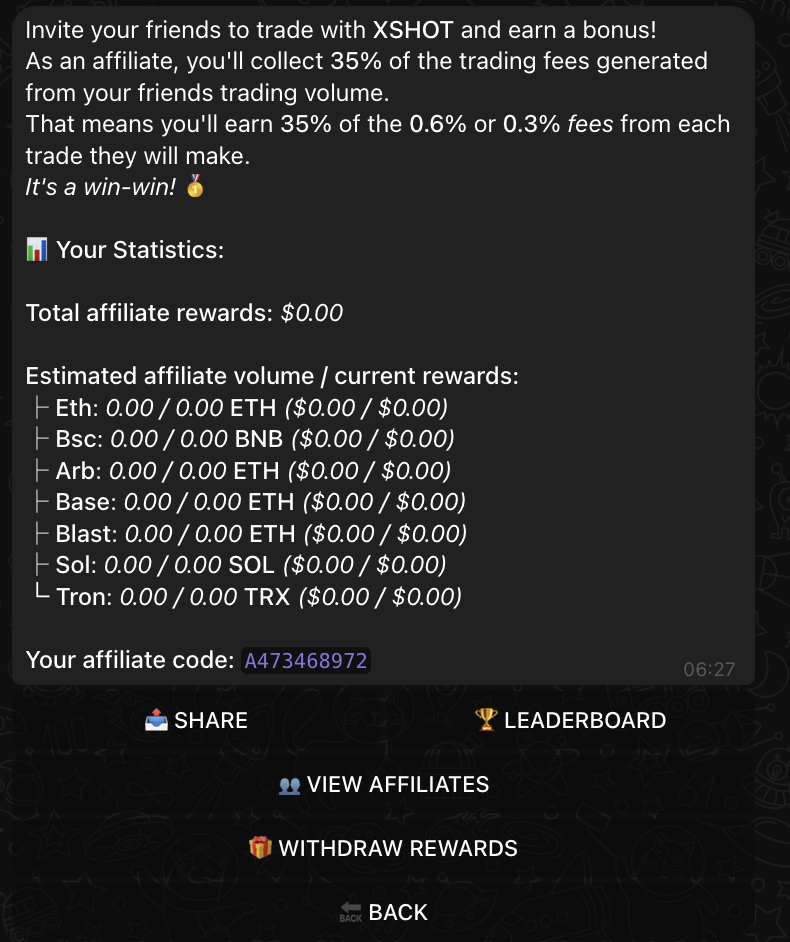
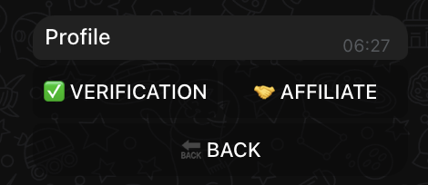
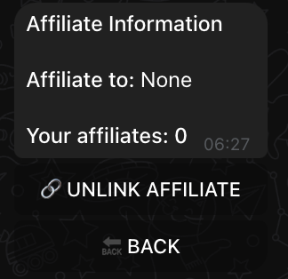
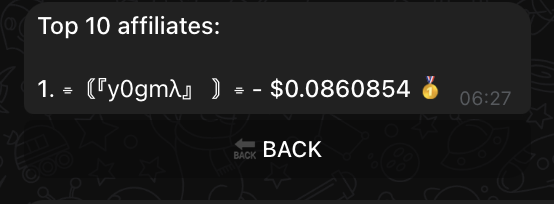

# ✨ XSHOT Affiliate Program

## Understanding Trading Volume
!!! tip "💡 How Easy Is $50K Monthly Volume?"
    Let's break it down:

    - Buying $2K of a token = $2K volume
    - Selling that $2K token = + $2K volume
    - Just 13 trades like this = Over $50K volume!
    - Many traders do this in days, not months

{ .screenshot-shadow }

## 🚀 Your Monthly Earning Potential With 10 Affiliates

Let's say you invite 10 average traders.

Each invite 3 average traders.

Each invite 2 average traders.

Each invite 1 average trader.


=== "💰 Non-Premium Network (0.6% fee)"
    ```mermaid
    graph TD
      classDef you fill:#E245DD,stroke:#B8860B,stroke-width:4px,color:black,font-weight:bold;
      classDef money fill:#22c55e,stroke:#15803d,stroke-width:2px,color:white,font-weight:bold;
      classDef network fill:#0ea5e9,stroke:#0284c7,stroke-width:2px,color:white;
      classDef total fill:#8b5cf6,stroke:#6d28d9,stroke-width:4px,color:white,font-weight:bold;

      You(("👑 YOU 👑<br/>$2,265 Monthly<br/>$27,180 Yearly"))

      L1("🌟 LEVEL 1<br/>10 Affiliate<br/>$50K × 10 = $500K Monthly Volume<br/>35% = $1,050/month")
      L2("⭐ LEVEL 2<br/>30 Traders<br/>$50K × 30 = $1.5M Volume<br/>3.5% = $315/month")
      L3("✨ LEVEL 3<br/>60 Traders<br/>$50K × 60 = $3M Volume<br/>3% = $540/month")
      L4("💫 LEVEL 4<br/>60 Traders<br/>$50K × 60 = $3M Volume<br/>2% = $360/month")

      You --> L1
      L1 --> L2
      L2 --> L3
      L3 --> L4

      L1 -. "$1,050" .-> You
      L2 -. "$315" .-> You
      L3 -. "$540" .-> You
      L4 -. "$360" .-> You

      class You you;
      class L1,L2,L3,L4 network;
    ```

=== "✨ Premium Network (0.3% fee)"
    ```mermaid
       graph TD
        classDef you fill:#E245DD,stroke:#B8860B,stroke-width:4px,color:#black!,font-weight:bold;
        classDef money fill:#22c55e,stroke:#15803d,stroke-width:2px,color:white,font-weight:bold;
        classDef network fill:#0ea5e9,stroke:#0284c7,stroke-width:2px,color:white;
        classDef total fill:#8b5cf6,stroke:#6d28d9,stroke-width:4px,color:white,font-weight:bold;

        You(("👑 YOU 👑<br/>$1,132.50 Monthly<br/>$13,590 Yearly"))

        L1("🌟 LEVEL 1<br/>10 Traders<br/>$50K × 10 = $500K Volume<br/>35% = $525/month")
        L2("⭐ LEVEL 2<br/>Each invite 3 = 30 Traders<br/>$50K × 30 = $1.5M Volume<br/>3.5% = $157.50/month")
        L3("✨ LEVEL 3<br/>Each invite 2 = 60 Traders <br/>$50K × 60 = $3M Volume<br/>3% = $270/month")
        L4("💫 LEVEL 4<br/>Each invite 1 = 60 Traders<br/>$50K × 60 = $3M Volume<br/>2% = $180/month")

        You --> L1
        L1 --> L2
        L2 --> L3
        L3 --> L4

        L1 -. "$525" .-> You
        L2 -. "$157.50" .-> You
        L3 -. "$270" .-> You
        L4 -. "$180" .-> You

        class You you;
        class L1,L2,L3,L4 network;
    ```
## 🎯 Getting Started

### Access Your Affiliate Dashboard
{ .screenshot-shadow }

1. Type `/profile` command
2. Select "AFFILIATE"
3. Get your unique referral code

### Manage Your Network
{ .screenshot-shadow }

Monitor:

- Direct referrals
- Network growth
- Earnings per chain
- Total volume

## 🏆 Compete and Grow
{ .screenshot-shadow }

- Track top performers
- Compare earnings
- Set growth targets

## 🌟 Key Features

=== "📊 Track Earning Growth"

    - Real-time statistics
    - Multi-chain monitoring
    - Automatic calculations
    - Track referrals

=== "💰 Withdrawals"

    - Choose any chain
    - No minimum limit
    - Instant processing


## 🚀 Ready to Start?

!!! tip "Next Steps"

    1. Access your dashboard
    2. Get your referral code
    3. Share with traders
    4. Build your network
    5. Watch earnings grow

[Start Earning →](../getting-started/setup-guide.md){ .md-button .md-button--primary }
[Join Community](https://t.me/xerc20){ .md-button }

## 🆘 Need Help?

Our community is here to support your growth:

[📱 Support](https://t.me/Xshot_trading){ .md-button .md-button--primary }
[👥 Community](https://t.me/xerc20){ .md-button }

!!! quote "💫 Remember"
    "Success in XSHOT isn't just about your trades - it's about building a thriving community and helping others succeed!"
