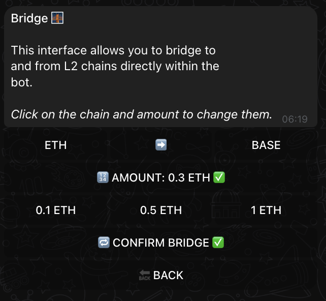

# 🌉 Bridging with XSHOT

## What is Bridging?

Bridging opens a world of cross-chain transactions.
It allows you to move or convert assets between different blockchains, tokens from one network to another.

## Current Bridging Capabilities

!!! info "Current Support"
    Type `/bridge` from anywhere in the bot to access bridging.
    Currently supports:

    - ETH → BASE
    - ETH → BLAST
    - ETH → ARBITRUM

!!! warning "Direction Matters"
    XSHOT currently only supports bridging FROM Ethereum TO L2s.
    L2 to L1 bridging coming soon!

## Using the Bridge

### Quick Access

Type `/bridge` from anywhere in the bot to access bridging.

### How It Works

{ .screenshot-shadow }

1. Bot uses your current chain as the FROM chain
2. Select destination chain
3. Choose amount
4. Confirm bridge transaction

=== "Chain Selection"

    - BASE
    - BLAST
    - ARBITRUM

=== "Amount Options"
    Quick select amount buttons:

    - 0.1 ETH
    - 0.5 ETH
    - 1 ETH
    - Custom X amount (the biggest button)

## Coming Soon™

!!! abstract "Roadmap"

    === "1. L2 → L1 bridging"

        - Navigate between different layer
        - Stay on XSHOT

    === "2. L2 ↔️ L2"

        - Move between L2s
        - Sell an ARB token for a BASE token

    === "3. L1 ↔️ L1"

        - Cross-chain possibilities
        - More network support

    === "Ultimate Vision"

        ALL ↔️ ALL

        - Bridge any token to any chain
        - One-click cross-chain trades
        - Example: Buy SOL tokens using ETH!

## Future Features Sneak Peek

!!! tip "Coming Features"
    Imagine buying any token on any chain using your preferred asset:

    1. Deposit TRON
    2. Buy KOKO (on SOL) and XERS (on ETH) directly with TRX
    3. XSHOT handles the bridging from TRON to SOL or ETH, then from ETH to XERS or SOL to KOKO
    4. Execute trade automatically and get the token in the SOL or ETH wallet!

    One deposit, endless possibilities!

## Best Practices

!!! success "Bridging Tips"

    1. Verify destination chain
    2. Double-check amounts
    3. Be patient with confirmations
    4. Keep some gas on both chains

## Need Help?

Questions about bridging? We're here:

[📱 Support Channel](https://t.me/Xshot_trading){ .md-button .md-button--primary }
[👥 Trading Community](https://t.me/xerc20){ .md-button }

!!! quote "💫 Future of Trading"
    "Soon, chain boundaries won't matter. One wallet, all chains, infinite possibilities with XSHOT!"
