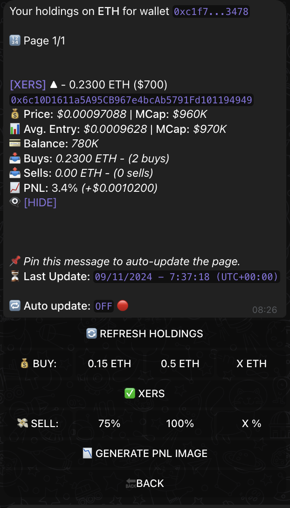
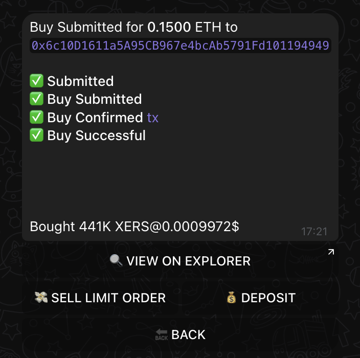
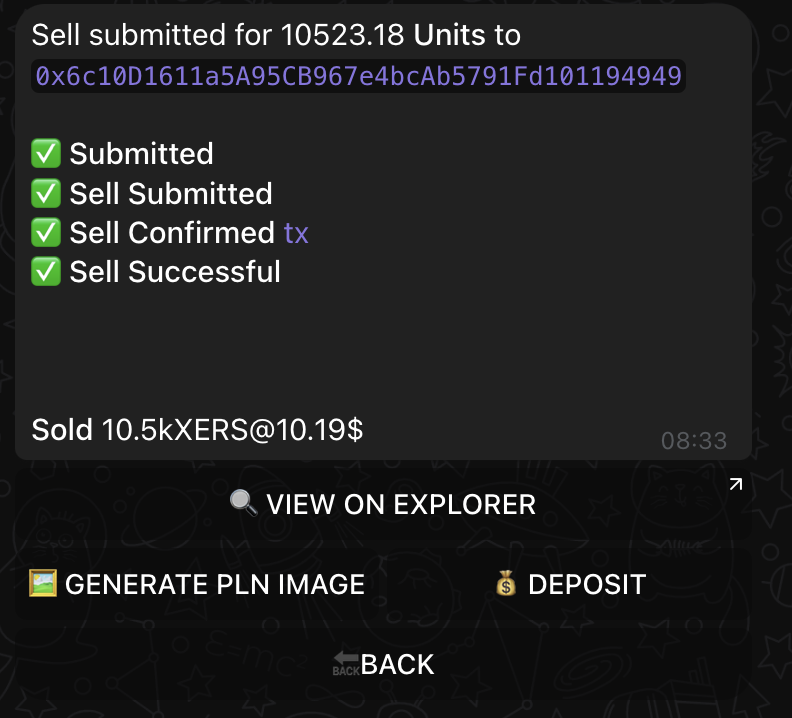

# 📈 Understanding Your Profits with XSHOT

Every successful trader knows that tracking your profits and losses is key to improving your trading game. Let's explore how XSHOT makes this not just easy, but actually enjoyable.

## Your Trading Dashboard

{ .screenshot-shadow }

When you open your holdings in XSHOT, you'll see everything that matters at a glance. Think of it as your trading command center – current prices, your entry points, and most importantly, how much you're up (or down) on each position.

!!! tip "Stay Updated in Real-Time"
    Pin your most important positions to get live updates.
    Just hit the message once and click "📌 Pin this message" and watch your PNL update in real-time.
    No more constant refreshing needed!

## Following Your Trades

### From Buy to Sell

Let's walk through a typical trading journey:

=== "When You Buy"
    { .screenshot-shadow }

    Just bought a promising token? XSHOT immediately shows you:

    - Your entry price
    - Amount purchased
    - Total investment

    This is your starting point for tracking success.

=== "While Holding"
    { .screenshot-shadow }

    This is where the magic happens. Watch your position grow:

    - Live price updates
    - Current profit/loss
    - Market movements

    Make informed decisions based on real data, not emotions.

=== "Taking Profits"
    { .screenshot-shadow }

    Ready to take profits? See your success at a glance:

    - Final profit numbers
    - Complete transaction details
    - Option to generate shareable results

## Sharing Your Success

After a successful trade, why not share it? XSHOT lets you generate beautiful PNL images that show off your trading prowess.
The picture include your referral code, you will inspire others while earning from their trades!

### Multi-Chain Mastery

Trading across different chains? No problem. XSHOT tracks everything:

!!! example "Your Complete Portfolio"
    Whether you're trading on Ethereum, BSC, Solana, or any other supported chain, see all your positions in one place. Each chain maintains its own tracking while giving you a complete portfolio overview.

## Making It Work for You

### Real-Time Updates

Gone are the days of constantly refreshing to check prices. With XSHOT, you have two powerful options:

1. **Pin Important Positions**
   Keep your eyes on what matters most with live updates.

2. **Quick Refresh**
   Need a quick check? One tap refreshes everything.

### Smart Trading Tools

XSHOT doesn't just track – it helps you trade better:

- Set limit orders based on your PNL goals
- Monitor multiple positions across chains
- Make informed decisions with complete data

### For Premium Traders

[XCALLER AI](../premium-features/xcaller-ai.md) takes your trading to the next level:

- Smart trade suggestions
- Automated limit sells
- Automatic Buying & Selling

## Growing as a Trader

Understanding your PNL isn't just about numbers – it's about growing as a trader. Use XSHOT's tracking to:

- Learn from your successes
- Understand your mistakes
- Improve your strategies
- Build your trading style

!!! quote "💎 Trading Wisdom"
    "The best traders aren't just good at buying and selling – they're masters at tracking and understanding their performance."

## Need Some Help?

We're here to support your trading journey:

[📱 Get Support](https://t.me/Xshot_trading){ .md-button .md-button--primary }
[🌟 Join Community](https://t.me/xerc20){ .md-button }

Remember, every great trader started somewhere. With XSHOT's PNL tracking, you're already on the path to better trading.

