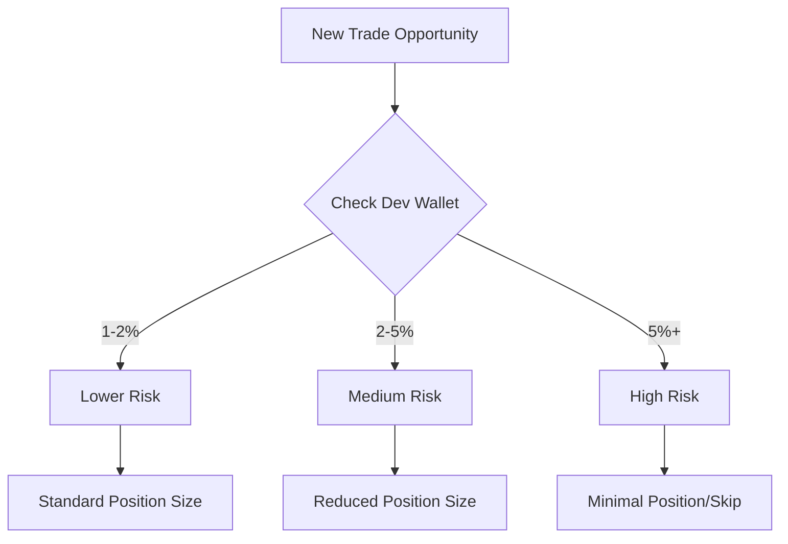

# 💎 Portfolio Management Guide

## Trading Fundamentals

!!! danger "🛡️ First Rule of Crypto Trading"
    Don't chase losses. Don't force trades. Save your ammunition for the right opportunities.

    As veterans say: "The market will be there tomorrow. Your capital might not be."

## 🎯 Trading Approaches

=== "🤖 XCALLER AI Trading"

    - AI-powered signals
    - Bundled buys for better entries
    - Risk management and Take Profit built-in
    - [Learn more about XCALLER AI](../premium-features/xcaller-ai.md)

=== "👨‍💻 Manual Trading"

    - Full control over trades
    - Requires more research
    - Higher time commitment
    - Greater learning curve

## 🔍 Due Diligence


### Supply Distribution Analysis
!!! tip "Dev Wallet Guidelines"
    - **Safe**: 1-2% dev holdings
    - **Caution**: 2-3% requires research
    - **High Risk**: >5% needs strong narrative
    - Always check for alternative wallets

### Red Flags Checklist
- [ ] Multiple dev wallets
- [ ] Copied website
- [ ] Mismatched social links
- [ ] No clear narrative
- [ ] Unverified DEX payment

### Dex Paid
!!! warning "Always Verify"
    Check token legitimacy using:
    ```
    https://checkdex.xyz/
    ```
    Paste token address to verify if DEXScreener is genuinely paid

## 📈 Trading Psychology

### Risk Management Rules

!!! success "Essential Rules"
    1. **Volume Matters**

        - Wait for active market days
        - Higher volume = better liquidity

    2. **Holder Analysis**

        - Rising holder count during dips is bullish
        - Track whale movements

    3. **Trust Balance**

        - Don't trust nobody = no gains
        - Trust everybody = no funds
        - Find middle ground

### 🎯 Success Principles

1. **Capital Preservation**
    ```mermaid
    graph LR
        A[Starting Capital] --> B[Essential]
        B --> C[Future Opportunities]
        C --> D[Long-term Success]
    ```

2. **Community Ethics**
    - Support your community
    - Don't dump on friends
    - Build reliable networks

3. **Chart Psychology**
    - Avoid 1-second timeframes on chart
    - Zoom out for perspective
    - Never panic sell

## 💰 Profit Management

!!! example "Profit Strategy"
    1. Set clear profit targets
    2. Scale out gradually
    3. Protect initial investment
    4. Keep some for moonshots

### Risk Assessment


## 🎓 Advanced Strategies

### Market Research
1. **Socials**
    - Follow key Twitter accounts
    - Notice narratives forming
    - Track successful traders

2. **Volume Analysis**
    - Track daily volume to find good day to trade
    - Compare volume across tokens


### Position Management
!!! tip "Some rules"
    1. Start small
    2. Scale based on conviction
    3. Never all-in !!!
    4. Keep dry powder

## 🚀 Using XSHOT Tools

### Portfolio Tracking
- Monitor holdings across chains
- Track PNL in real-time
- Set price alerts
- [Learn more about tracking features](../features/pnl-tracking.md)

### Risk Controls
- Use limit orders
- Set stop losses
- Monitor position sizes
- [Learn about limit orders](../features/trading/limit-orders.md)

## 🎯 Key Takeaways

!!! abstract "Remember"
    1. Trust your gut over influencers
    2. Make your own decisions
    3. Protect your profits
    4. Stay patient
    5. Keep learning

## 🆘 Need Help?

Lost on a trade? Need guidance?

[📱 Support Channel](https://t.me/Xshot_trading){ .md-button .md-button--primary }
[👥 Trading Community](https://t.me/xerc20){ .md-button }
[📚 Common Issues](../troubleshooting/common-issues.md){ .md-button }

!!! quote "💫 Trading Wisdom"
    "The market is a device for transferring money from the impatient to the patient."
