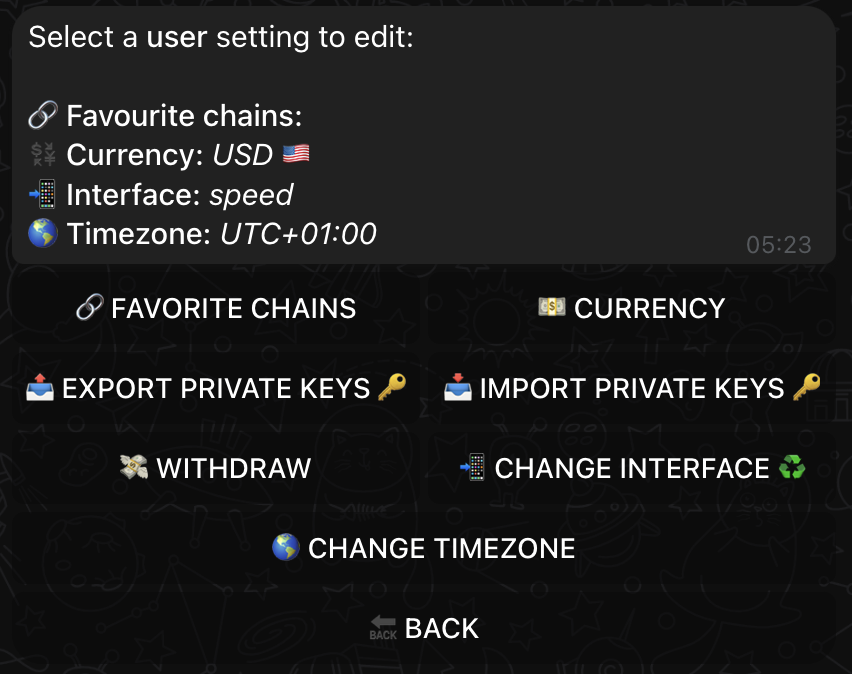
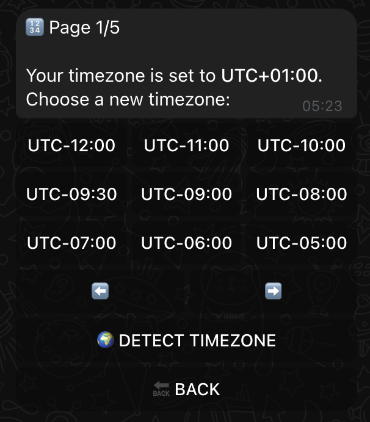
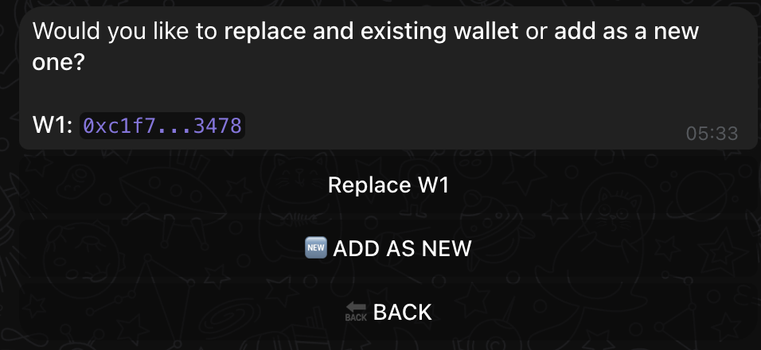
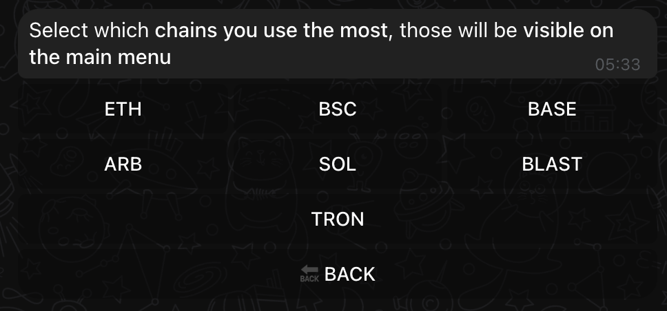

# ⚙️ Making XSHOT Your Own

# User Settings

To make XSHOT as seamless and customized as possible,
In the User Settings screen, you can review and adjust your preferences, export or import private keys, modify the user interface for speed or simplicity, and more.

{ .shadow }

Every great trader customizes their tools. Let's make XSHOT work perfectly for you, one chain at a time.

### 1. Currency Selection

Select your preferred currency for displaying values across XSHOT. This currency will be used for all trade values, balance amounts, and more, making it easy to keep track of your financials in a familiar format.

{ .shadow }

- **Recommended**: USD is a popular choice, but feel free to select any currency you’re most comfortable with.

### 2. Timezone Configuration

Setting your timezone allows XSHOT to align with your local time, which is crucial for time-based features like automated buy/sell actions and real-time call notifications.

{ .shadow }

- **Mobile Tip**: On Telegram, tap **Detect Timezone** and share your location to automatically sync your timezone based on your location.
- **Manual Option**: You can also select your timezone manually by scrolling through the available UTC options.

### 3. Wallet Management

For secure and flexible trading, import any wallet keys you intend to use with XSHOT. Importing as a "new wallet" ensures that existing wallets aren’t overwritten, helping you keep access to all your funds.

{ .shadow }

!!! warning "Important: Wallet Safety"
    When importing a wallet, always choose **Add as New** unless you specifically want to replace an existing wallet. Choosing "Replace" can overwrite access to an old wallet, risking loss of funds.

### 4. Favorite Chains

Selecting your favorite chains allows you to access frequently used blockchains directly from the main menu. By choosing your preferred chains, you can quickly switch between them or access them with a single touch on the main screen.

{ .shadow }

- **Tip**: If no chains are selected, XSHOT provides a single swipe feature to switch between all available chains.
- **Quick Access**: Selected chains appear as quick-access buttons, making it easier to trade on your chosen networks.

# Trading Settings

!!! danger "🚨 Critical to Remember"
    Settings are CHAIN-SPECIFIC, not global!

    What you set for ETH won't apply to BASE or SOL.
    Configure each chain separately for your perfect setup.

## Your Command Center
{ .screenshot-shadow }

This screen tells you everything about your current setup:

- Which blockchain you're configuring
- How fast your transactions will execute (gas settings)
- How much you are willing to lose on a transaction (slippage)
- Your quick-trade arsenal (buy buttons)
- Market monitoring setup (price alerts)

## Fine-Tune Your Trading

=== "🔄 SWITCH CHAIN"
    !!! abstract "Network Control"
        Switch between networks to configure each chain perfectly:

        - **ETH**: High-value trades, higher fees
        - **BASE**: Budget-friendly transactions
        - **SOL**: Lightning-fast execution
        - **And others**: Each with unique settings

=== "⛽ GAS SETTINGS"
    !!! abstract "Speed Control"
        Choose your transaction speed:

        - `NORMAL`: Standard speed, lower fees
        - `HIGH`: Priority execution
        - `CUSTOM`: Advanced gas control

        ???+ tip "When to Use"
            - Use NORMAL for regular trades
            - Switch to HIGH in volatile markets
            - CUSTOM for precise gas control

=== "🛡️ SLIPPAGE KEYBOARD"
    !!! abstract "Trade Protection"
        Configure your trading safety:

        - **AUTO**: Smart protection
            - Automatic adjustments
            - MEV protection
            - Optimal execution

        - **MANUAL**: Custom control
            - Set exact percentages
            - Chain-specific settings
            - Token-based adjustment

=== "💰 QUICK BUY KEYBOARD"
    !!! abstract "Quick Trading"
        Personalize your trading shortcuts:

        - **Preset Amounts**: Your common trade sizes
        - **One-Click Trading**: Faster execution
        - **Chain-Specific**: Different for each network

        ???+ example "Example Setup"

            - ETH: 0.1, 0.5, 1.0 ETH
            - BASE: 0.5, 1.0, 2.0 ETH
            - SOL: 10, 20, 50 SOL

## Making It Work For You

!!! tip "Power User Strategy"
    Start with one chain you trade most:

    1. Set up gas for your trading style
    2. Configure slippage protection
    3. Create your quick buy shortcuts
    4. Then move to your next chain

### Ready to Dive Deeper?

Each setting has its own treasure trove of knowledge:

[⛽ Master Gas](../user-guide/gas-fee-configuration.md){ .md-button .md-button--primary }
[🛡️ Perfect Slippage](../user-guide/slippage-settings.md){ .md-button .md-button--primary }
[💨 Quick Buy Magic](../user-guide/quick-buy-keyboard.md){ .md-button .md-button--primary }

!!! info "Just Starting?"
    Take it one chain at a time. Get comfortable with one network's settings before expanding your trading universe.

## Need Help?

Your settings questions answered:

[📱 Get Support](https://t.me/Xshot_trading){ .md-button }
[👥 Join Community](https://t.me/xerc20){ .md-button }

!!! quote "🎯 Remember"
    "The perfect setup isn't universal - it's personal. Make XSHOT yours."
