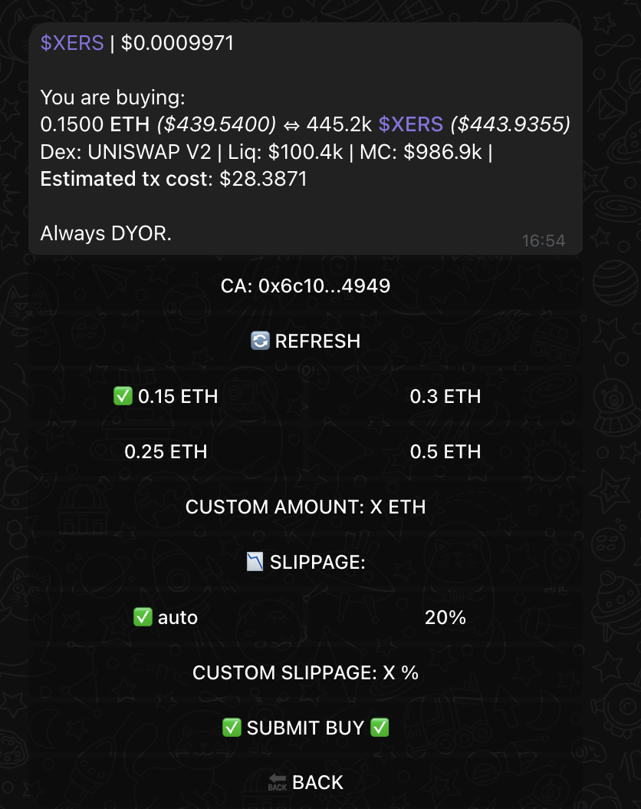
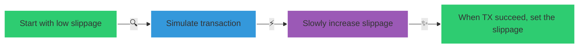
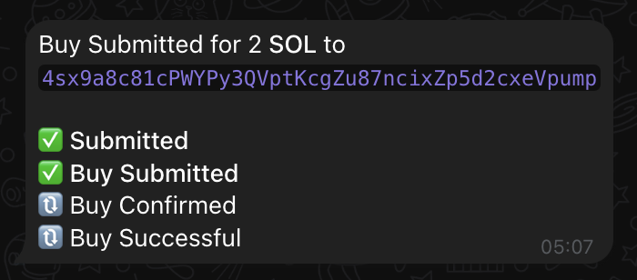
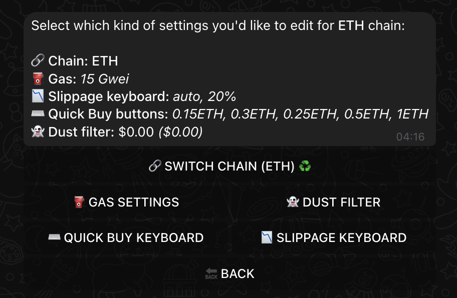
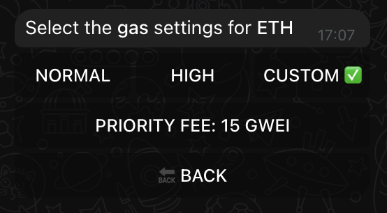

# Buying with XSHOT

Ready to start trading? Let's master XSHOT's powerful buying features!

---

## ⚡ Quick Buy Process

{ .screenshot-shadow style="width: 50%;" }

=== "🎯 One-Click Trading"
    Just paste any contract address and watch XSHOT:

    1. 🔍 Auto-detect token & chain
    2. 📊 Show price and market data
    3. ⚙️ Prepare optimal settings
    4. 🚀 Ready for your trade

=== "💫 Smart Features"
    Built-in technology working for you:

    - 🔄 Automatic chain detection
    - 📈 Real-time price display
    - 💎 Liquidity information
    - 💰 Cost estimation

=== "💰 Choose Your Amount"
    Quick Buy Options:

    - Preset amounts for quick trading
    - Values based on your setup preferences
    - "CUSTOM AMOUNT" for precise control

    !!! tip "💡 Customize"
        Adjust your quick buy amounts in Chain Settings to match your trading style

---

## 🎮 Trading Controls

### 🔄 Smart Slippage System

Our advanced slippage technology works behind the scenes:

=== "🤖 Auto Mode"
    Let XSHOT find optimal slippage:

    - ✨ Starts with minimum value
    - 🎯 Tests transaction success
    - 💪 Finds best setting automatically

=== "🎛️ Manual Mode"
    For advanced traders:

    - 🎮 Custom slippage values
    - ⚡ Direct control
    - 🔧 Your preferred settings

---

## 📊 Transaction Monitoring

{ .screenshot-shadow style="width: 70%;" }

Track your transaction status:

1. ⭐ **Order Created** `Submitted`
2. 🌟 **Sent to Blockchain** `Buy Submitted`
3. ✨ **Transaction Confirmed** `Buy Confirmed`
4. 💫 **Tokens Received** `Buy Successful`

???+ success "🎯 Perfect Execution"
    Look for all four ✅ marks to confirm your successful purchase!

---

## ⚙️ Advanced Settings

### 🔧 In case of transaction failure

In main menu, chain settings
=== "🎛️ Chain Configuration"
    { .screenshot-shadow }

    Fine-tune your experience:

    - ⚡ Gas preferences
    - 💰 Quick buy amounts
    - 📊 Slippage presets

=== "⚡ Gas Settings"
    { .screenshot-shadow }

    Control execution speed:

    - 🚶‍♂️ NORMAL: Standard priority
    - 🏃‍♂️ HIGH: Enhanced speed
    - 🏎️ CUSTOM: Maximum control

---

## 🎓 Pro Trading Tips

!!! tip "💡 Speed Optimization"

    - 📌 Keep contract addresses handy
    - ⚡ Pre-set your gas settings
    - 🎯 Use quick buy options

!!! warning "⚠️ Trade Protection"
    If transaction fails:

    1. 🔄 Increase priority fee
    2. ⏱️ Try higher slippage
    3. 📈 Check network status

!!! success "🌟 Best Practices"

    - 🔍 Verify contracts
    - 💰 Check liquidity
    - ⚖️ Monitor gas prices

---

## 🎯 Ready to Trade?

Start trading in three simple steps:

1. 📋 Paste contract address
2. 💰 Select amount
3. 🚀 Confirm your trade

## 📚 Next Steps

Continue your trading journey:

[📊 Manage Holdings](../../features/portfolio-management.md){ .md-button .md-button--primary }
[💰 Sell Tokens](../../features/trading/selling.md){ .md-button .md-button--primary }

!!! tip "🌟 Complete Experience"
    Check our selling guide to master the full trading cycle with XSHOT!

---

## 🆘 Need Assistance?

We're here to help:

[📱 Support Channel](https://t.me/Xshot_trading){ .md-button .md-button--primary }
[👥 Main Community](https://t.me/xerc20){ .md-button }
[📚 Common Issues](../../troubleshooting/common-issues.md){ .md-button }

!!! quote "💫 XSHOT Promise"
    "Making crypto trading simple, fast, and efficient!"
