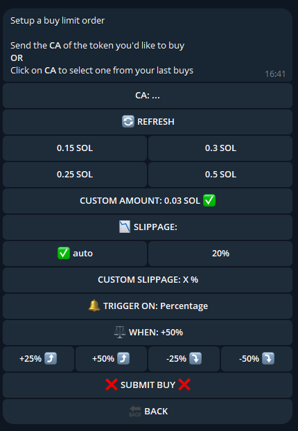
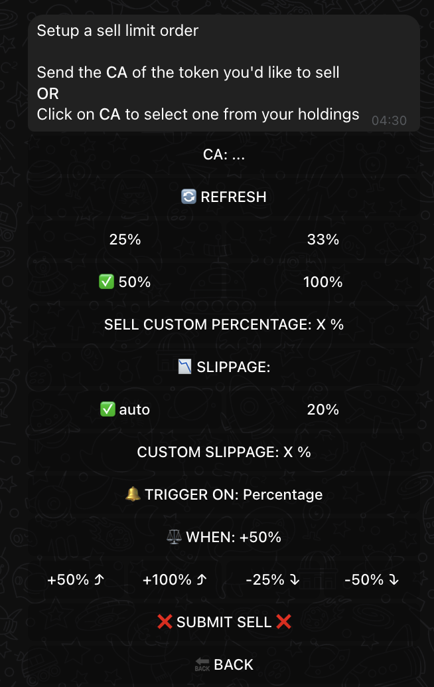
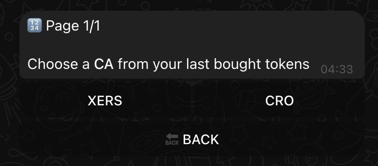
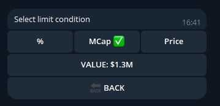
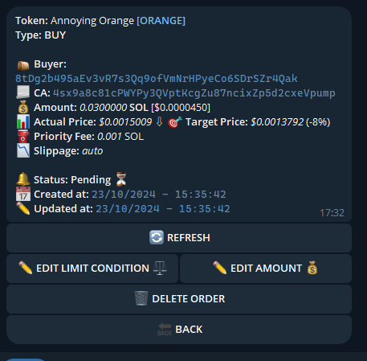
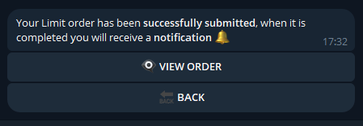

# 🎯 Mastering Limit Orders

Take your trading to the next level with XSHOT's powerful limit orders. Set your targets, let the bot execute perfectly timed trades.

## 💫 What Are Limit Orders?

!!! success "Smart Trading"
    Limit orders let you:

    - 🎯 Set future buy/sell targets
    - 🤖 Execute trades automatically
    - ⏰ Expire after 24h (normal user) or 72h (premium user)
    - 📈 Track market conditions

## 🔄 Types of Limit Orders

=== "🛍️ Limit Buy"
    { .screenshot-shadow }

    Set up automatic buys when:

    - Price hits your target
    - Market cap reaches level
    - Percentage change occurs

=== "💰 Limit Sell"
    { .screenshot-shadow }

    Lock in profits automatically:

    - Set profit targets
    - Secure your gains
    - Exit at perfect times

---

## 🎯 Setting Up Limit Orders

### Buy Limits

#### 1. Choose Your Token
{ .screenshot-shadow }

- Paste any contract address
- Select from recent buys
- Refresh for latest prices

#### 2. Select Trigger Condition

!!! success "Condition is always set to start at the current price/marketcap by default"

    1. Use percentage adjusters for quick targets
    2. Set realistic trigger conditions
    3. Monitor orders regularly
    4. Update based on market conditions

{ .screenshot-shadow }

=== "📊 Percentage"

    Watch for price changes
    Use quick adjusters:

    - +25%, +50% for upward targets
    - -25%, -50% for dips

=== "💎 Market Cap"

    - Track project growth
    - Set MCap targets
    - Use adjusters for quick calculations

=== "💰 Price"

    - Set specific price targets
    - Precise entry points
    - Easy adjustment button

#### 3. Fine-Tune Your Order
- Set buy amount
- Configure slippage
- Review conditions

### Sell Limits

1. **Select Limit Sell from main menu**

    - Choose token to sell
    - Set percentage to sell
    - Define exit strategy

2. **Set Your Targets**
    Quick Target Adjusters:

    - +50%  → Quick profit target
    - +100% → Double your money
    - -25%  → Stop loss
    - -50%  → Emergency exit

!!! tip "⚡ Power User Tip"
    Use the percentage adjusters to quickly move your target up (+50%, +100%) or down (-25%, -50%) without manual calculations!

## 📊 Managing Your Orders

{ .screenshot-shadow }

Monitor and modify your active orders:

=== "👀 View Order"

    - Check status
    - Track progress
    - View conditions

=== "✏️ Edit Order"

    Modify any time:

    - Change conditions
    - Adjust amounts
    - Update targets

=== "❌ Cancel Order"

    - Remove pending orders
    - Start fresh

## 🎉 Order Success

{ .screenshot-shadow }

When your order hits:

1. Get instant notification
2. Review execution
3. Track in holdings
4. Set new targets

## ⭐ Premium Benefits

!!! info "💎 Premium Advantage"

    - Extended order duration (72h vs 24h)
    - More time for targets to hit
    - Perfect for longer-term strategies

    [Learn More About Premium →](../premium-features/premium-chat.md){ .md-button }

## 🎓 Pro Tips

!!! success "Master Limit Orders"

    1. Use percentage adjusters for quick targets
    2. Set realistic trigger conditions
    3. Monitor orders regularly
    4. Update based on market conditions

!!! warning "Important Notes"

    - Orders expire after 24h (72h for premium)
    - Keep enough funds for buy orders
    - Review conditions before submitting

## 🚀 Extend limit to 72h with premium

[Learn more →](../premium-features/xcaller-ai.md){ .md-button }

## Need help? We're here:

[📱 Support Channel](https://t.me/Xshot_trading){ .md-button } [👥 Trading Community](https://t.me/xerc20){ .md-button }
