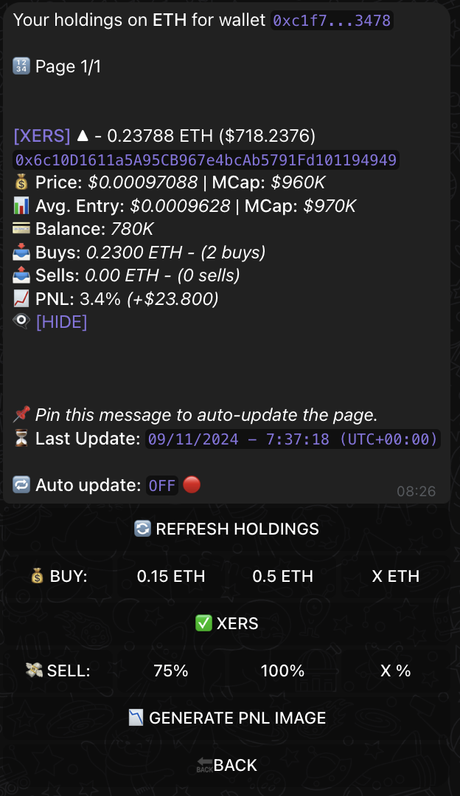
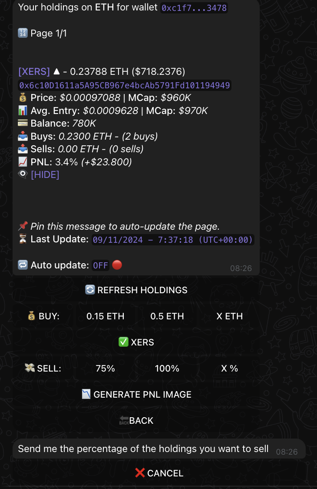
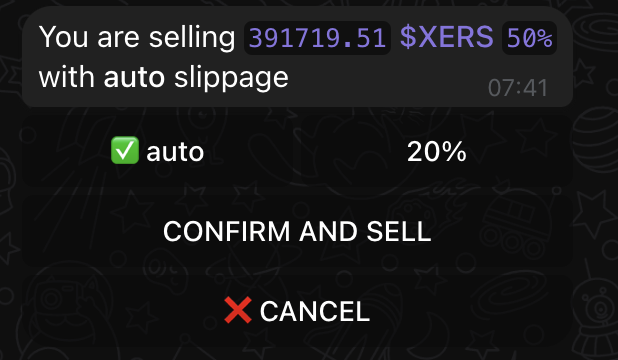
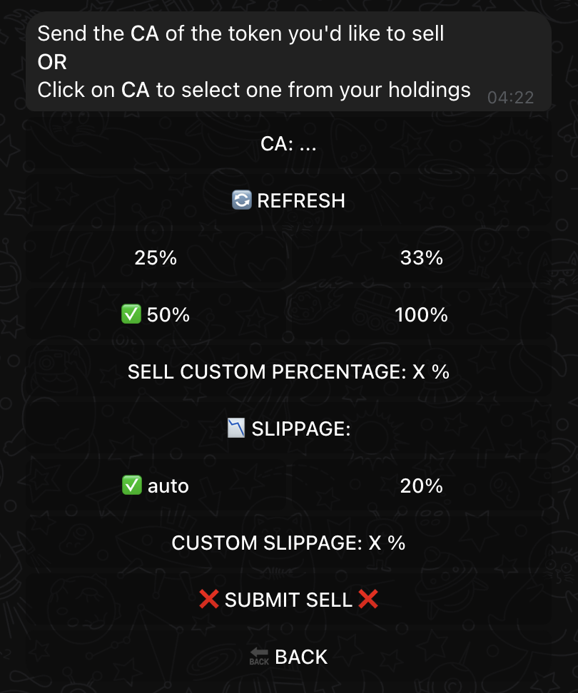

# Selling with XSHOT
Don't forget to take profit! See how:

## Just Bought Your Token?
{ .screenshot-shadow }

Congratulations on your purchase! After a successful buy, you have two ways to manage your position:

- Monitor through Holdings
- Use the Sell interface

[Need help buying? Check our buying guide →](buying.md){ .md-button }

---

## Accessing Your Selling Options

{ .screenshot-shadow }

From the main menu, you can:

1. Check your position in "💼 HOLDINGS"
2. Click "💰 SELL TOKENS" to access sell interface

!!! tip "Pro Tip"

    Always check your position value before deciding to sell.

---

## Method 1: Selling Through Holdings

### Check Your Position
{ .screenshot-shadow }

Your holdings show:

- Current token price
- Your balance
- Your entry price
- Live PNL tracking

!!! tip "📌 Auto-Update Feature"

    Click the holding message once, and select "Pin" to keep track of your investment value in real-time!
    You'll see AUTO UPDATE text turn green! 🟢

    Remember: Only one message can be pinned - simply switch tokens in your pinned message to check different holdings.

### Setting Up Your First Sell
{ .screenshot-shadow }

Let's sell half our position:

1. Click custom percentage
2. Enter "50" for half your holdings
3. Review the amount

### Confirm Your Sale
{ .screenshot-shadow }

The bot will show:

- Amount being sold
- Auto-slippage setting
- Final confirmation button

### First Sell Complete!
{ .screenshot-shadow }

Watch for all green checkmarks:

- ✅ Submitted
- ✅ Sell Submitted
- ✅ Sell Confirmed
- ✅ Sell Successful

---

## Method 2: Using Sell Interface

### Access Sell Interface
{ .screenshot-shadow }

For selling the remaining 50% you need to select the token you hold by clicking on CA.

### Select Your Token
{ .screenshot-shadow }

Choose from your holdings:

- Click to see available tokens
- Select your token (MIND)
- No need to paste CA

### Second Sell Complete!
{ .screenshot-shadow }

Again, wait for all confirmations:

- ✅ Submitted
- ✅ Sell Submitted
- ✅ Sell Confirmed
- ✅ Sell Successful

---

## 📊 Track Your Performance

{ .screenshot-shadow }

After completing your trades:

- View final PNL
- Check transaction history
- Generate shareable image

!!! success "💎 Share Your Success"

    Use the "GENERATE PNL IMAGE" button to create a beautiful performance card to share with your friends!

## 🌟 Ready to Level Up?

Turn your trading success into passive income:

- Share your PNL images to flex on your friends
- Promote your referral code and earn 25% of your friend's trading fees forever

[🎯 Learn More About Our Affiliate Program →](../affiliate-program.md){ .md-button .md-button--primary }

!!! tip "💡 Quick Tips"

    - Always check your position value before selling
    - Use auto-slippage for optimal execution
    - Wait for all confirmations before closing windows
    - Track your performance straight trough holdings.

## 🆘 Need Help?

[📱 Support Channel](https://t.me/Xshot_trading){ .md-button }
[👥 Trading Community](https://t.me/xerc20){ .md-button }
