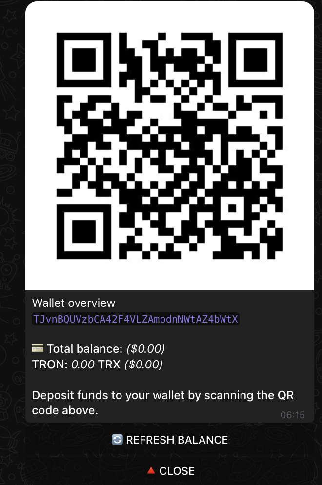
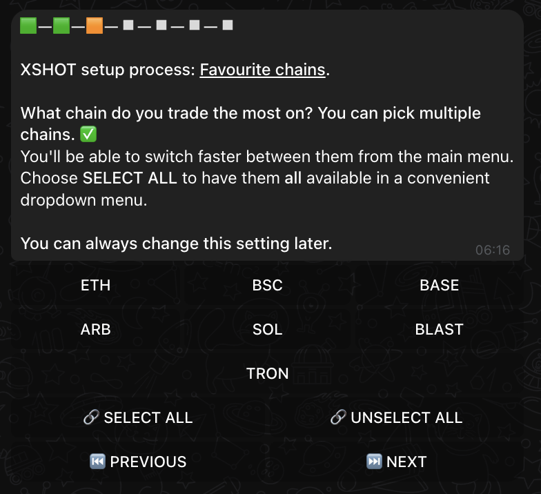

# Setup Guide

Welcome to the XSHOT Bot setup process! This guide will walk you through configuring your bot for optimal trading performance. Each choice you make during setup will customize your trading experience for your specific needs.

## Initial Setup

{ .screenshot-shadow }

When you first start the XSHOT Bot, you'll be greeted with the setup process. The bot will automatically:

- Generate your trading wallets:
    - 1 EVM wallet (for Ethereum, BSC, Base, Blast, Arbitrum)
    - 1 SOL wallet
    - 1 TRON wallet

!!! warning "Important"
    The setup process will modify settings on all chains. Any previous settings will be reset.

## Private Key Export

{ .screenshot-shadow }

=== "Step 1: Export Keys"
    1. Click "🔑 EXPORT ALL KEYS" to reveal your private keys
    2. Each key will be shown individually with a copy button
    3. Store these keys securely

=== "Step 2: Save Keys"
    For each key shown:

    1. Click "📋 COPY" to copy the key
    2. Store it in a secure location
    3. Never share these keys with anyone

=== "Step 3: Import Wallets"
    Import your keys to:

    - [Rabby Wallet](https://rabby.io/) for EVM chains
    - [Backpack](https://backpack.app/) for Solana

!!! danger "Security Warning"
    - Never share your private keys with anyone
    - Store them in a secure password manager
    - These keys provide complete access to your funds

## Deposit Setup

{ .screenshot-shadow }

Choose your preferred blockchain for initial deposits:

- 💰 DEPOSIT FOR EVM
- 💰 DEPOSIT FOR SOLANA
- 💰 DEPOSIT FOR TRON

After selecting a chain, you'll see the wallet overview:

{ .screenshot-shadow }

The overview provides:

- QR code for easy deposits
- Wallet address
- Current balances across all chains
- Total balance in your selected currency

Features available:

- 🔄 REFRESH BALANCE: Update your balances
- 🔺 CLOSE: Return to setup

## Chain Selection

{ .screenshot-shadow }

Select your preferred trading chains:

=== "Available Chains"
    - ETH (Ethereum)
    - BSC (Binance Smart Chain)
    - BASE
    - ARB (Arbitrum)
    - SOL (Solana)
    - BLAST
    - TRON

=== "Quick Options"
    - 🔗 SELECT ALL: Enable all chains
    - 🔗 UNSELECT ALL: Start fresh

???+ tip "Pro Tip"
    Selected chains will be available in a convenient dropdown menu for quick access during trading.

## Transaction Size Levels

Choose your typical transaction size to optimize your trading interface:

| Level                                             | Range         | Quick Buy Buttons |
|:--------------------------------------------------|:--------------|:-----------------|
| :fontawesome-solid-coins: **Micro**               | Below $100    | `$25` `$50` `$75` `$100` |
| :fontawesome-solid-chart-line: **Small**          | $100 - $500   | `$100` `$250` `$350` `$500` |
| :fontawesome-solid-chart-column: **Medium**       | $500 - $1000  | `$500` `$750` `$850` `$1000` |
| :fontawesome-solid-money-bill-trend-up: **Large** | $1000 - $5000 | `$1000` `$2500` `$3500` `$5000` |
| :fontawesome-solid-1: **Whale**                   | Above $5000   | `$5000` `$7500` `$10000` `$15000` |

???+ tip "Quick Buy Configuration"
    Your selection determines the quick buy button amounts for faster trading. Choose based on your typical investment size.

## Trading Style Selection

{ .screenshot-shadow }

=== "Newly Listed Tokens"
    - Focus on new opportunities
    - Higher risk/reward ratio
    - Aggressive slippage settings
    - Best for experienced traders

=== "Established Tokens"
    - Trade proven tokens
    - Lower risk profile
    - Conservative slippage settings
    - Suitable for beginners

=== "Variety of Tokens"
    - Balanced approach
    - Mixed risk profile
    - Flexible settings
    - Good for diverse strategies

## Premium Features

!!! success "XSHOT Premium Capabilities"

=== "Trading Benefits"
    - 💰 **Competitive Fees**
        - Trading: Only 0.30% - 50% OFF
        - Withdrawals: 0.00% (FREE)

=== "AI Features"
    - 🤖 **XCALLER AI**
        - 70%+ Success Rate
        - Real-time Multi Chain Trading Signals
        - Automatic Sniper
        - Smart Market Analysis

=== "Community"
    - 💎 **Elite Access**
        - Premium Signals Channel
        - Exclusive Community Chat
        - Direct Access to Market Veterans

### How to Access Premium

=== "Step 1: Get XERS"
    Choose your preferred method to acquire 500K $XERS tokens:

    [Buy with XSHOT :robot:](https://t.me/xshot_trading_bot?start=buy=0x6c10D1611a5A95CB967e4bcAb5791Fd101194949){ .md-button }
    [Buy on Uniswap :fontawesome-solid-arrow-right-arrow-left:](https://app.uniswap.org/tokens/ethereum/0x6c10d1611a5a95cb967e4bcab5791fd101194949){ .md-button }
    [Buy on Flooz :fontawesome-solid-water:](https://flooz.xyz/trade/0x6c10D1611a5A95CB967e4bcAb5791Fd101194949?network=eth){ .md-button }

    ???+ tip "Smart Choice"
        Using XSHOT Bot for purchases provides the most seamless experience with automatic premium integration.

=== "Step 2: Stake Tokens"
    Stake your 500K XERS tokens:

    1. Visit the [XERS Staking Platform](https://staking.xprojecterc.com/){ .md-button .md-button--primary }
    2. Connect your wallet
    3. Stake your tokens
    4. Keep them staked to maintain premium access

    ???+ warning "Important"
        Make sure to stake the full 500K XERS to qualify for premium features.

=== "Step 3: Verify"
    Complete verification to activate premium features:

    [Start Verification :fontawesome-solid-check:](https://t.me/xshot_trading_bot?start=verification){ .md-button .md-button--primary }

    The bot will guide you through:

       1. Wallet connection
       2. Stake verification
       3. Premium activation

### Quick Access

!!! tip "Access Anytime"
    - Type `/premium` in the bot to check your status or start the upgrade process
    - Premium features activate instantly upon successful verification
    - Access remains active as long as your XERS tokens stay staked

### Premium Support
We have a dedicated support team for you, and the community as well ready to assist you.
Need help with setting up XSHOT or accessing premium ?

[Support Channel :fontawesome-solid-headset:](https://t.me/Xshot_trading){ .md-button }

### Community Chat (No Support)
[Main Community :fontawesome-solid-users:](https://t.me/xerc20){ .md-button }

--8<-- "includes/abbreviations.md"
