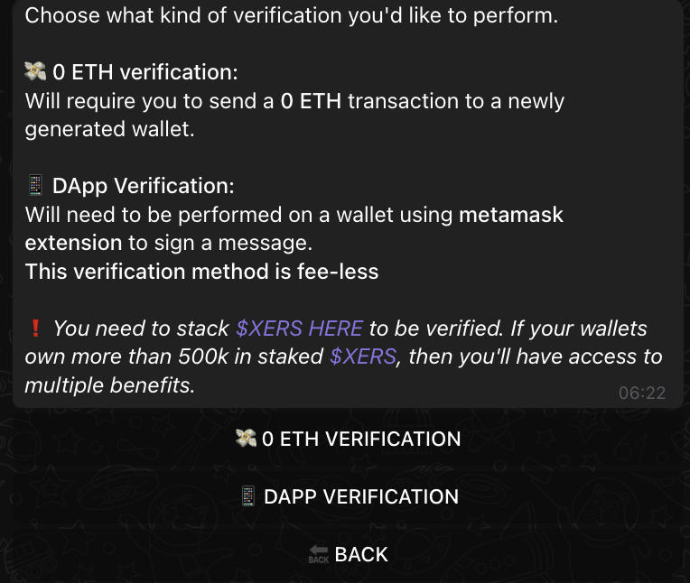
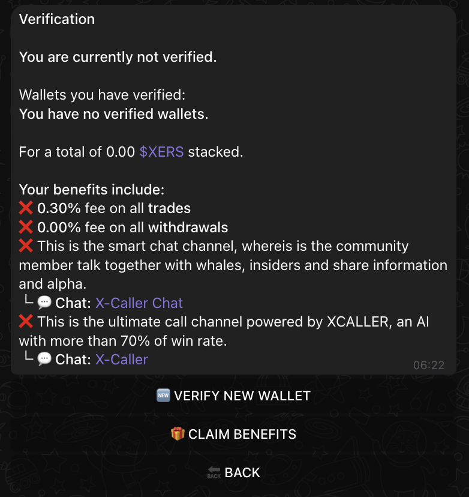
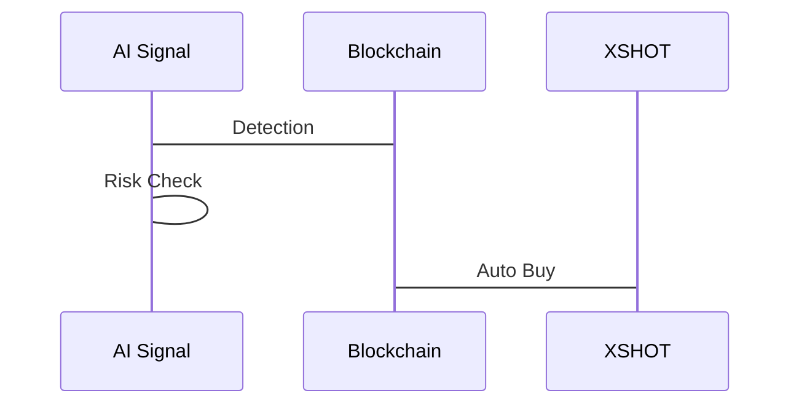

---
hide:
  - navigation
  - toc
---

# XCALLER AI

<div class="grid cards" markdown>

-   :rocket: __Advanced Trading Intelligence__

    ---

    Next-generation cross-chain trading bot powered by sophisticated algorithms that revolutionizes how you trade.

    [:octicons-arrow-right-24: Getting Started](#getting-started)

-   :robot: __Automated Execution__

    ---

    Experience lightning-fast response times with our AI-powered trading signals.

    [:octicons-arrow-right-24: Features](#seamless-call-delivery)

-   :chart_with_upwards_trend: __70%+ Win Rate__

    ---

    Stay ahead of the market with our proven AI system and community insights.

    [:octicons-arrow-right-24: Premium Benefits](#premium-benefits)

-   :shield: __Risk Management__

    ---

    Trade with confidence using our comprehensive [MEV protection](../security/mev-protection.md) and advanced detection systems.

    [:octicons-arrow-right-24: Security](#protection-systems)

</div>

---

## Overview

XCaller AI is a cutting-edge trading intelligence system that delivers high-potential trading calls across multiple blockchain networks. By combining artificial intelligence, market analysis, and deep blockchain monitoring, XCaller identifies profitable trading opportunities and delivers them directly to you.

Behind every call you receive, our system processes vast amounts of on-chain data, monitoring successful traders, tracking proven deployers, and analyzing market movements to identify the most promising opportunities.

## How It Works

### Smart Signal Generation
Our backend systems continuously analyze:

- Smart money movements and wallet patterns
- Successful deployer activities and their new tokens
- Real-time volume surges and market momentum
- Key opinion leader actions and their impact
- Cross-chain opportunities and trends

These complex analyses are distilled into clear, actionable trading calls delivered directly to you.

### Seamless Call Delivery
When XCaller identifies a high-potential opportunity, you receive a complete trading call including:

- Token contract address ready for trading
- Early entry
- Full scan of the contract address

### XShot Integration
Every call can be automatically executed through our XShot auto-buy feature, ensuring you never miss an opportunity. This seamless integration means you can:

- Execute trades instantly when calls are received
- Maintain optimal entry points
- Automate your trading strategy (automatic take profit)
- Trade across multiple chains effortlessly and automatically

## Premium Access Requirements

### Staking Requirements

!!! info "How to Qualify"

    1. Acquire 500K $XERS tokens
    2. [Stake through our platform](https://staking.xprojecterc.com/)
    3. Maintain staked position for continuous access

### Verification Process

{ .screenshot-shadow }

Choose your preferred verification method:

=== "0 ETH Verification"

    - Send 0 ETH transaction
    - Proves wallet ownership
    - One-time verification

=== "DApp Verification"

    - Use Metamask extension
    - Sign message (fee-less)
    - Quick and simple

!!! warning "Important"
    Verification requires staking $XERS [HERE](https://staking.xprojecterc.com/).
    Wallet must maintain 500k+ staked $XERS for premium access.

### Premium Benefits

{ .screenshot-shadow }

Once verified, you unlock:

1. **Reduced Fees**
    - 0.30% trading fee (reduced)
    - 0.00% withdrawal fee
    - Cost-effective trading

2. **Exclusive Access**
    - [X-Caller Chat](https://t.me/+kIG4Sg8P3FplNjM0)
    -
        - Community insights
        - Whale trading signals
        - Real-time alpha

    - [X-Caller Channel](https://t.me/+frtyOlqlv99lNzBk)
    -
        - AI trading signals
        - 70%+ win rate
        - Instant alerts

3. **Advanced Features**
    - `/autobuy` command access
    - Extended limit order duration from 24h to 72h
    - Priority execution

## XCALLER AI Features

### Auto-Buy Functionality



Access through `/autobuy` command:

- Instant signal execution
- Risk assessment
- [MEV protection](../security/mev-protection.md)

### Signal Accuracy

!!! success "Proven Performance"

    - 70%+ win rate
    - Real-time monitoring
    - Multi-chain coverage
    - Risk management

### Community Benefits

- Real-time market insights
- Expert trader discussions
- Collaborative analysis
- Instant signal alerts

## Technical Details

### Protection Systems

=== "Trade Protection"

    - [MEV protection](../security/mev-protection.md)
    - [Smart slippage](../user-guide/slippage-settings.md)
    - Risk assessment

=== "Execution"

    - Priority transaction trough bundle buying
    - [Gas optimization](../user-guide/gas-fee-configuration.md)
    - Smart transaction routing

### Multi-Chain Support

Supported networks:

- [Ethereum](../supported-chains/ethereum.md)
- [BSC](../supported-chains/binance-smart-chain.md)
- [Base](../supported-chains/base.md)
- [Arbitrum](../supported-chains/arbitrum.md)
- [Blast](../supported-chains/blast.md)
- [Solana](../supported-chains/solana.md)
- [TRON](../supported-chains/tron.md)

## Getting Started

1. **Stake XERS**

    - Acquire 500K $XERS
    - Stake tokens
    - [Learn about staking](../premium-features/staking.md)

2. **Verify Wallet**

    - Type `/premium`
    - Choose verification method
    - Complete verification

3. **Access Features**

    - Join exclusive channels
    - Enable `/autobuy`
    - Start receiving signals

!!! tip "Quick Commands"
    ```bash
    /premium    # Access premium features / verify
    /autobuy    # Configure auto-buying
    ```

## Why Choose XCaller?

### Intelligence-Driven Calls
Every call you receive is the result of comprehensive market analysis. Our systems process thousands of data points to identify only the most promising opportunities, ensuring each call has genuine potential for profit.

### Perfect Timing
XCaller's advanced monitoring systems work around the clock to identify opportunities at the optimal moment, giving you early access to potentially profitable trades before they become widely known.

### Risk-Focused Approach
Each call comes with carefully calculated entry and exit points, helping you manage risk effectively while maximizing potential returns. Our systems analyze multiple risk factors before generating any call, ensuring you receive only the highest quality signals.

### Cross-Chain Coverage
XCaller monitors opportunities across multiple blockchain networks simultaneously, ensuring you never miss out on profitable trades, regardless of which chain they appear on.

### Quality Assurance
Our sophisticated backend systems filter out noise, scams, and low-quality opportunities. You receive only thoroughly vetted calls that have passed our strict criteria for potential profitability.

Remember: While our complex AI systems and monitoring tools work tirelessly in the background, you only see the result - clean, actionable trading calls ready for immediate execution. We handle the complexity; you focus on the profits.

## Support & Resources

Need assistance? We're here to help:

[📱 Support Channel](https://t.me/Xshot_trading){ .md-button .md-button--primary }
[👥 Trading Community](https://t.me/xerc20){ .md-button }
[📚 Documentation](../index.md){ .md-button }

!!! quote "Join the Future of Trading"
    XCALLER AI: Where artificial intelligence meets human expertise for superior trading results.

[Get Started Now](../getting-started/setup-guide.md){ .md-button .md-button--primary }
[Learn More](../features/trading/buying.md){ .md-button }
