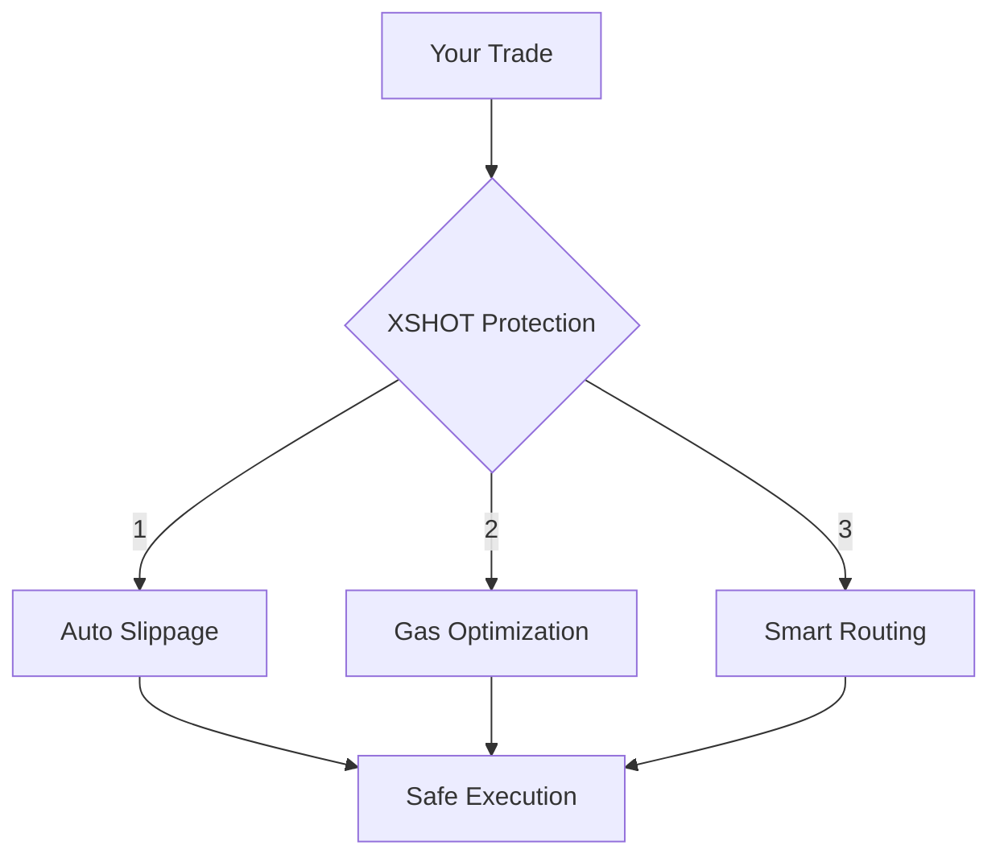

# 🛡️ Understanding MEV Protection in XSHOT

## What is MEV?

Maximal Extractable Value (MEV) represents profit that can be extracted from your trades through:

- Transaction ordering
- Front-running
- Sandwich attacks

!!! danger "Trading Without Protection"
    Unprotected trades can lead to:

    - Higher costs
    - Worse execution prices
    - Lost opportunities
    - Sandwich attacks

## XSHOT's Built-in Protection

!!! success "Always-On Protection"
    XSHOT includes automatic MEV protection in every trade:

    === "Auto-Slippage"

        - Smart slippage calculation
        - Dynamic adjustments
        - Optimal execution

        [Learn more about Slippage →](../user-guide/slippage-settings.md)

    === "Gas Optimization"

        - Intelligent gas pricing
        - Transaction timing
        - Network awareness

        [Learn more about Gas →](../user-guide/gas-fee-configuration.md)

    === "Smart Routing"

        - Protected transaction paths
        - MEV-resistant execution
        - Optimal routing strategies

## How Protection Works

## Trading with Protection

### Buying Safely

- Auto-slippage enabled by default
- Smart gas optimization
- Protected routing

[Learn more about Buying →](../features/trading/buying.md)

### Selling Securely

- MEV-resistant exits
- Optimal timing
- Protected execution

[Learn more about Selling →](../features/trading/selling.md)

### Advanced Protection

=== "Limit Orders"
    Use limit orders for:

    - Larger trades
    - Better pricing
    - Reduced MEV exposure
    [Learn more about Limits →](../features/trading/limit-orders.md)

=== "Portfolio Management"
    Monitor your trades:

    - Track executions
    - Verify prices
    - Monitor slippage
    [Learn Portfolio Tools →](../features/portfolio-management.md)

## Protection Across Chains

Each blockchain has unique MEV characteristics. XSHOT adapts protection accordingly:

- [Ethereum](../supported-chains/ethereum.md): Highest MEV activity
- [Base](../supported-chains/base.md): Growing MEV landscape
- [Arbitrum](../supported-chains/arbitrum.md): L2 specific protection
- [Other chains](../supported-chains/index.md): Customized strategies

## Complete Protection Guide

### Essential Documentation

Find MEV protection details in these related guides.

=== "Core Protection"

    - [Slippage Settings](../user-guide/slippage-settings.md)
    - [Gas Configuration](../user-guide/gas-fee-configuration.md)
    - [Chain Settings](../features/settings.md)

=== "Trading Guides"

    - [Buying Guide](../features/trading/buying.md)
    - [Selling Guide](../features/trading/selling.md)
    - [Limit Orders](../features/trading/limit-orders.md)

=== "Advanced Features"

    - [Portfolio Management](../features/portfolio-management.md)
    - [PNL Tracking](../features/pnl-tracking.md)
    - [Chain-Specific Guides](../supported-chains/index.md)

## Best Practices

!!! tip "Maximize Your Protection"

    1. Keep auto-slippage enabled
    2. Use limit orders for large trades
    3. Monitor transaction status
    4. Follow [chain-specific guides](../supported-chains/index.md)

## Need Help?

Having protection questions?

[📱 Support Channel](https://t.me/Xshot_trading){ .md-button .md-button--primary }
[👥 Trading Community](https://t.me/xerc20){ .md-button }
[📚 Common Issues](../troubleshooting/common-issues.md){ .md-button }

!!! quote "💫 Remember"
    "XSHOT's MEV protection works silently but effectively, keeping your trades safe across all chains."
