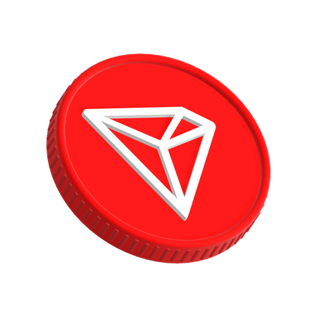

# Supported Chains

XSHOT Bot enables trading across multiple blockchains, providing a seamless trading experience across different ecosystems.

## Current Support Status

=== "Active Chains"

    ### High Performance Chains

    - { width="20px" } [Solana](solana.md)

    [:octicons-cpu-24: XCaller AI Enabled](../premium-features/xcaller-ai.md){ .md-button .md-button--primary }

    ### EVM Compatible

    - { width="20px" } [Arbitrum](arbitrum.md)
    - { width="20px" } [Base](base.md)
    - { width="20px" } [Binance Smart Chain](binance-smart-chain.md)
    - { width="20px" } [Blast](blast.md)
    - { width="20px" } [Ethereum](ethereum.md)

    ### Other Chains

    - { width="20px" } [Tron](tron.md)

=== "Coming Soon"

    ### In Development

    - { width="20px" } [S Chain (Previously FTM)](s.md)
    - { width="20px" } [SUI](sui.md)
    - { width="20px" } [BTC L2](btc.md)
    - { width="20px" } [TON](ton.md)

    [:octicons-info-24: Learn More](upcoming-chains.md){ .md-button }

## Feature Comparison

=== "Trading Features"

    | Chain | Manual Trading | XCaller AI | Chain Type |
    |-------|:-------------:|:----------:|:----------:|
    | { width="20px" } [Solana](solana.md) | ✅ | ✅ | L1 |
    | { width="20px" } [Arbitrum](arbitrum.md) | ✅ | ❌ | L2 |
    | { width="20px" } [Base](base.md) | ✅ | ❌ | L2 |
    | { width="20px" } [BSC](binance-smart-chain.md) | ✅ | ❌ | L1 |
    | { width="20px" } [Blast](blast.md) | ✅ | ❌ | L2 |
    | { width="20px" } [Ethereum](ethereum.md) | ✅ | ❌ | L1 |
    | { width="20px" } [Tron](tron.md) | ✅ | ❌ | L1 |

=== "Network Stats"

    | Chain | Block Time | Avg. Fee | DEX Support |
    |-------|:----------:|:--------:|:-----------:|
    | { width="20px" } Solana | 400ms | < $0.01 | Raydium, Orca |
    | { width="20px" } Arbitrum | 2s | $0.1-0.5 | Camelot, Uniswap |
    | { width="20px" } Base | 2s | $0.01-0.05 | BaseSwap, Uniswap |
    | { width="20px" } BSC | 3s | $0.1-0.3 | PancakeSwap |
    | { width="20px" } Blast | 2s | $0.01-0.05 | BlastSwap |
    | { width="20px" } Ethereum | 12s | $2-20 | Uniswap |
    | { width="20px" } Tron | 3s | < $0.1 | SunSwap |

!!! tip "XCaller AI Trading"
    Currently, automated trading with XCaller AI is exclusively available on Solana. [Learn more about XCaller AI](../premium-features/xcaller-ai.md).

!!! info "Upcoming Integration"
    Visit our [upcoming chains](upcoming-chains.md) page to learn about new chains being added to XSHOT, including S Chain, SUI, BTC L2, and TON.

## Trade now with XSHOT on...

### { .chain-icon-small } Solana
Ultra-fast L1 with sub-second finality. Home to [XCaller AI](../premium-features/xcaller-ai.md) automated trading.
[Learn more](solana.md)

### { .chain-icon-small } Ethereum
The foundation of DeFi. Trade on Uniswap with advanced MEV protection.
[Learn more](ethereum.md)

### { .chain-icon-small } BSC
High-throughput EVM chain with low fees. Trade on PancakeSwap.
[Learn more](binance-smart-chain.md)

### { .chain-icon-small } Arbitrum
Leading ETH L2 with optimal gas fees. Trade on Camelot and Uniswap.
[Learn more](arbitrum.md)

### { .chain-icon-small } Base
Coinbase's L2 solution. Trade on BaseSwap and Uniswap V3.
[Learn more](base.md)

### { .chain-icon-small } Blast
Native yield L2 with ultra-low fees. Trade on BlastSwap.
[Learn more](blast.md)

### { .chain-icon-small } Tron
Established chain with near-zero fees. Trade on SunSwap.
[Learn more](tron.md)

## Coming Next

### { .chain-icon-small } S Chain
Evolution of Fantom. High-performance with advanced aBFT consensus.
[Learn more](s.md)

### { .chain-icon-small } SUI
Next-gen L1 with parallel execution and Move language.
[Learn more](sui.md)

### { .chain-icon-small } BTC L2
Bitcoin scaling solution with smart contract capabilities.
[Learn more](btc.md)

### { .chain-icon-small } TON
Telegram's blockchain with massive adoption potential.
[Learn more](ton.md)

