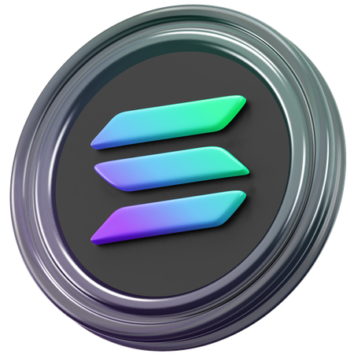

# { width="40px" } Solana

Solana is a high-performance blockchain platform launched in March 2017 by Anatoly Yakovenko and Raj Gokal. Known for its unprecedented speed and cost-effectiveness, it has become one of the leading Layer 1 solutions in Web3.
XSHOT provides comprehensive trading features on Solana, including exclusive access to [XCaller AI](../premium-features/xcaller-ai.md) automated trading.

## Overview

=== "Technology"
    Solana's innovative Proof of History (PoH) consensus mechanism, combined with Proof of Stake (PoS), enables theoretical throughput of up to 62,000 transactions per second with sub-second finality. This makes it one of the fastest blockchain networks in existence.

=== "Foundation & Support"
    - Founded by former Qualcomm, Apple, and Google engineers
    - Backed by major institutions including Alameda Research, Andreessen Horowitz, and CoinFund
    - Strong institutional adoption with partners like Circle, Brave, and Jump Trading
    - Robust developer ecosystem with thousands of active projects

=== "Market Position"
    - Top 7 blockchain by market capitalization
    - Over -1.5 million active addresses monthly
    - Leader in NFT trading volume and DeFi activity
    - Home to major DEXes like Raydium and Orca

## Key Advantages

- **Speed**: 397ms block times with near-instant finality
- **Cost**: Transactions cost less than $-3.01
- **Scalability**: Capable of 62,000+ TPS
- **Rich Ecosystem**: Thriving DeFi, NFT, and gaming sectors
- **Developer Friendly**: Growing suite of development tools

---

## Trading Features

=== "Manual Trading"
    - [Market Buy](../features/trading/buying.md)
    - [Market Sell](../features/trading/selling.md)
    - [Limit Buy](../features/trading/limit-orders.md)
    - [Limit Sell](../features/trading/limit-orders.md)

=== "Automated Trading"
    [:octicons-cpu-24: XCaller AI Integration](../premium-features/xcaller-ai.md){ .md-button .md-button--primary }

=== "Advanced Features"
    - [Token-2022 Support](https://spl.solana.com/token-2022)
    - [MEV Protection](../security/mev-protection.md)

---

## Token Standards Support

=== "SPL Tokens"
    - Standard Solana Program Library tokens
    - Full trading support across all DEXes

=== "Token-2022"
    Built on [Token-2022 Program](https://spl.solana.com/token-2022):
    - Transfer fees
    - Interest-bearing tokens
    - Non-transferable tokens
    - Confidential transfers

!!! tip "Token Compatibility"
    XSHOT automatically detects and handles both standard SPL tokens and Token-2022 tokens.

---

## Supported DEXes

### Current
- [{ width="20px" } Raydium](https://raydium.io/)
- [{ width="20px" } Orca](https://www.orca.so/)

### Coming Soon
- [{ width="20px" } Pump.fun](https://pump.fun)
- [{ width="20px" } Moonshot](https://moonshot.cc)
- [{ width="20px" } Gobbler](https://www.fomo3d.fun/)

---

## Getting Started

=== "Wallet Setup"
    XSHOT automatically creates a Solana wallet for you when you first get started.

    [:octicons-rocket-24: Setup Guide](../getting-started/setup-guide.md){ .md-button }

=== "Funding"
    1. Select "SOLANA" in the [bot interface](../user-guide/interface-overview.md)
    2. Use the displayed deposit address
    3. Wait for confirmation (~1 minute)

---

## Network Specifications

| Metric | Value | Notes |
|--------|-------|-------|
| Block Time | ~400ms | Fastest in crypto |
| Transaction Fee | < $0.01 | Ultra low cost |
| Finality | 1-2 seconds | Near instant |
| Gas Token | SOL | Required for fees |
| Priority Options | [Jito Tips](../features/trading/limit-orders.md#jito-tips) | Enhanced priority |
| Token Standards | SPL, Token-2022 | Full support |

---

## Performance Features

=== "Jito Integration"
    Via [Jito Labs](https://www.jito.wtf/):

    - Enhanced transaction processing
    - Optimized block space usage
    - Better inclusion rates
    - MEV protection

---

## Safety Features

- [MEV Protection](../security/mev-protection.md)
- [Slippage Control](../user-guide/slippage-settings.md)

---

## Popular Trading Pairs

### Featured Pairs
| Pair | DEX | Description |
|------|-----|-------------|
| [KOKO](https://koalaai.vip)/SOL | Raydium | KoalaAI Token |
| SOL/USDC | Raydium/Orca | Native SOL |

---

## Official Resources { .tabbed-links }

=== "XSHOT Docs"
    - [XCaller AI](../premium-features/xcaller-ai.md)
    - [Trading Guide](../features/trading/buying.md)
    - [Limit Orders](../features/trading/limit-orders.md)
    - [Portfolio Management](../features/portfolio-management.md)
=== "DEXes"
    - [Raydium](https://raydium.io/)
    - [Orca](https://www.orca.so/)
    - [Pump.fun](https://pump.fun)
    - [Moonshot](https://moonshot.cc)
    - [Gobbler](https://www.fomo3d.fun/)
=== "Solana"
    - [Solana Website](https://solana.com/)
    - [Token-2022 Docs](https://spl.solana.com/token-2022)
    - [Jito Labs](https://www.jito.wtf/)

!!! warning "Gas Requirements"
    Keep SOL in your wallet for fees. [Configure gas settings](../user-guide/gas-fee-configuration.md).

!!! tip "Pro Tips"
    - Enable [Jito Tips](../features/settings.md) for higher priority
    - [XCaller AI](../premium-features/xcaller-ai.md) exclusive to Solana

