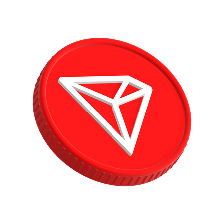

# { width="40px" } Tron

Tron, launched in 2017 by Justin Sun, is a blockchain platform focused on content delivery and digital entertainment, now evolved into a comprehensive DeFi ecosystem.
XSHOT provides comprehensive trading features on Tron through SunSwap.

## Overview

=== "Technology"
    Tron uses a Delegated Proof of Stake (DPoS) consensus mechanism with Super Representatives, enabling high throughput and near-zero transaction costs.

=== "Foundation & Support"
    - Founded by Justin Sun
    - Acquired BitTorrent to expand ecosystem
    - Strong Asian market presence
    - Strategic partnerships with enterprises

=== "Market Position"
    - Leading blockchain for USDT transactions
    - Billions in DeFi TVL
    - Strong stablecoin ecosystem
    - High daily transaction volume

## Key Advantages

- **Cost**: Near-zero transaction fees
- **Speed**: 3-second block time
- **Stability**: Established ecosystem
- **Adoption**: Wide stablecoin usage
- **Accessibility**: User-friendly

---

## Trading Features

=== "Available Trading Types"
    - [Market Buy](../features/trading/buying.md)
    - [Market Sell](../features/trading/selling.md)
    - [Limit Buy](../features/trading/limit-orders.md)
    - [Limit Sell](../features/trading/limit-orders.md)

=== "Unique Features"
    - [Cross-Chain Bridging](../features/bridging.md)
    - [MEV Protection](../security/mev-protection.md)
    - Native TRX gas optimization

!!! note "XCaller AI"
    Automated trading via XCaller AI is currently only available on Solana.

## Supported DEXes

### Current
- [{ width="20px" } SunSwap](https://sunswap.com)

## Getting Started

=== "Wallet Setup"
    XSHOT automatically creates a Tron wallet for you.

    [:octicons-rocket-24: Setup Guide](../getting-started/setup-guide.md){ .md-button }

=== "Funding"
    1. Select "TRON" in the [bot interface](../user-guide/interface-overview.md)
    2. Use the displayed deposit address
    3. Wait for confirmations (recommended: 2-3 blocks)

!!! warning "Gas Requirements"
    Keep sufficient TRX in your wallet for gas fees. While Tron offers very low fees, you still need TRX for transactions.

## Network Specifications

| Metric | Value | Notes |
|--------|-------|-------|
| Block Time | ~3 seconds | Fast finality |
| Transaction Fee | < $0.1 | Ultra-low cost trading |
| Finality | ~15 seconds | Quick confirmations |
| Gas Token | TRX | Required for all transactions |
| Token Standard | TRC20 | ERC20-compatible |

## Performance Features

=== "Gas Optimization"
    - Smart energy allocation
    - Bandwidth optimization
    - Resource management
    - Ultra-low fees

=== "MEV Protection"
    - Anti-sandwich protection
    - Front-running mitigation
    - Private transaction routing
    - Slippage optimization

=== "Cross-Chain Features"
    Support for bridging from and to any L1 soon.

    [:octicons-arrow-switch-24: See Bridging Guide](../features/bridging.md){ .md-button }

## Safety Features

- [MEV Protection](../security/mev-protection.md)
- [Slippage Control](../user-guide/slippage-settings.md)
- [Gas Fee Configuration](../user-guide/gas-fee-configuration.md)

## Official Resources { .tabbed-links }

=== "Tron"
    - [Tron Website](https://tron.network)
    - [TronScan](https://tronscan.org)
    - [Tron Bridge](https://bridge.tron.network)

=== "DEX"
    - [SunSwap](https://sunswap.com)

=== "XSHOT Docs"
    - [Trading Guide](../features/trading/buying.md)
    - [Limit Orders](../features/trading/limit-orders.md)
    - [Portfolio Management](../features/portfolio-management.md)
    - [Bridge Guide](../features/bridging.md)

!!! tip "Pro Tips"
    - Tron offers some of the lowest fees in crypto
    - Use limit orders for more precise trading
    - Monitor [TronScan](https://tronscan.org) for network status

!!! warning "Important Notes"
    - Always keep TRX for gas fees
    - Verify contract addresses on [TronScan](https://tronscan.org)
