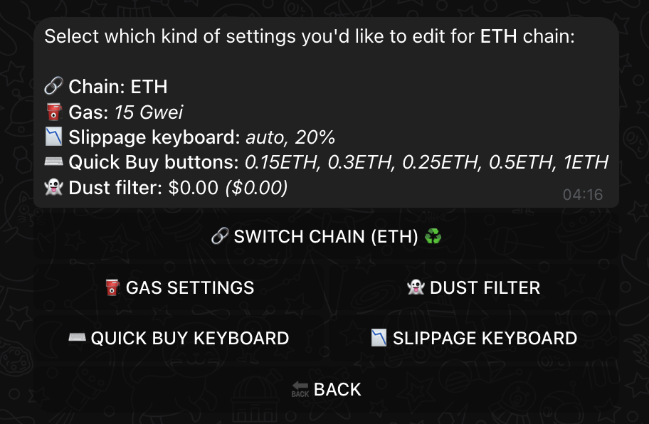
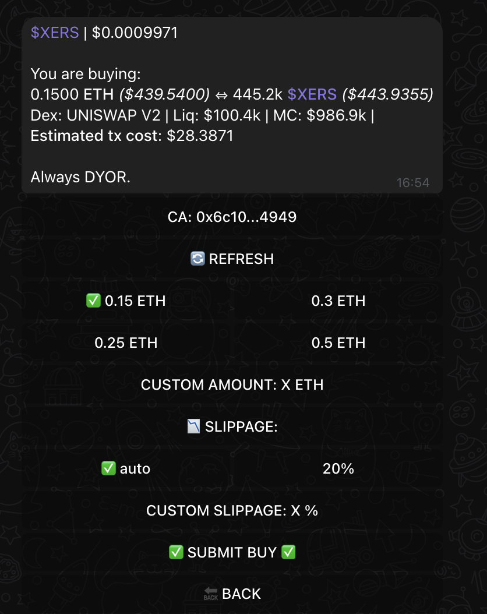

# 🔧 Common Issues & Quick Fixes

## Transaction Failed? Let's Fix It!

### Method 1: Adjust Gas Settings (Try This First)

1. 🏠 Go to main menu
2. ⚙️ Click "Chain Settings" (bottom right)
3. ⛽ Select "GAS SETTINGS"

{ .screenshot-shadow }

{ .screenshot-shadow }

=== "Step 1: Try HIGH"

    - Click "HIGH" option
    - Attempt transaction again

=== "Step 2: Try CUSTOM"
    If HIGH doesn't work:

    - Select "CUSTOM"
    - Set value higher than HIGH
    - Try transaction again

!!! tip "💡 Gas Tip"
    Start with HIGH setting before using CUSTOM values

{ .screenshot-shadow }

### Method 2: Increase Slippage

If gas adjustment didn't help:

{ .screenshot-shadow }

1. 🎯 In buy screen
2. ⚙️ Disable "auto" slippage
3. 📊 Set custom value higher than current
4. 🔄 Try transaction again

!!! warning "Important"
    Always start with gas adjustment before changing slippage

### Quick Resolution Guide

!!! success "🎯 Resolution Steps"
    1. First try HIGH gas
    2. Then try CUSTOM gas (higher value)
    3. Finally adjust slippage if needed

## Still Having Issues?

Need more help? We're here for you:

[📱 Support Channel](https://t.me/Xshot_trading){ .md-button .md-button--primary }
[👥 Main Community](https://t.me/xerc20){ .md-button }

