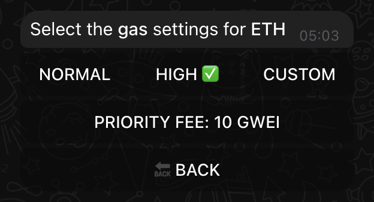
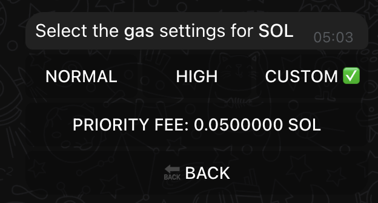

# ⛽ Gas Fees

Understanding and configuring gas fees properly can make the difference between successful trades and failed transactions. Let's master gas settings in XSHOT.

## Understanding Gas Fees

Gas fees are transaction costs paid to blockchain networks for processing your trades. Each chain handles these differently, and XSHOT lets you optimize them all.

!!! info "Chain-Specific Settings"
    Remember: Each blockchain maintains its own gas settings - configure them individually for optimal trading.

## Gas Fees Across Chains

!!! abstract "Network Cost Overview"
    === "Ethereum & L2s"
        | Chain | Typical Range | High Traffic | Low Traffic |
        |-------|--------------|--------------|-------------|
        | ETH   | 30-50 GWEI   | 100+ GWEI    | 15-25 GWEI |
        | BASE  | 1-3 GWEI     | 5-10 GWEI    | <1 GWEI    |
        | ARB   | 0.1-0.3 GWEI | 0.5+ GWEI    | 0.1 GWEI   |
        | BLAST | 1-3 GWEI     | 5-10 GWEI    | <1 GWEI    |

    === "Solana"
        | Condition | Priority Fee (SOL) |
        |-----------|-------------------|
        | Normal    | 0.000001-0.00001  |
        | High      | 0.0001-0.001      |
        | Peak      | 0.001-0.01        |

    === "TRON"
        No manual gas configuration needed - TRON handles fees automatically.

## Accessing Gas Settings

{ .screenshot-shadow }

To configure gas for any chain:

1. Access chain settings
2. Select "GAS SETTINGS"
3. Choose appropriate option

## Configuration Options

{ .screenshot-shadow }

=== "NORMAL"

    - Standard transaction speed
    - Lower fees
    - Good for casual trading

=== "HIGH"

    - Faster execution
    - Higher priority
    - Better for urgent trades

=== "CUSTOM"

    - Set specific amounts
    - Maximum control
    - Advanced users

## Network Patterns & Optimal Trading Times

### Ethereum Network
!!! tip "ETH Peak Hours"

    📈 **High Traffic**:

      - US Market Hours (9:30 AM - 4 PM EST)
      - NFT Launches
      - Major Token Events

    📉 **Low Traffic**:

      - Weekend Asian Hours
      - Early European Hours
      - Late US Hours

### Base & L2 Chains
!!! info "L2 Activity"

    📈 **Busy Periods**:

      - New Protocol Launches
      - Liquidity Mining Events
      - US Evening Hours

    📉 **Quiet Times**:

      - Early Morning Hours (EST)
      - Weekend Mornings
      - Between Major Events

### Solana Network
{ .screenshot-shadow }

!!! info "SOL Traffic"

    📈 **Peak Times**:

      - NFT Mints
      - Major IDOs
      - Market Volatility

    📉 **Optimal Trading**:

      - Standard Market Hours
      - Between Major Events
      - Stable Market Periods

### Peak Hours Strategy
!!! example "High Traffic Approach"

    - ETH: Use HIGH (100+ GWEI)
    - BASE: Consider 5+ GWEI
    - ARB: Might need 0.5+ GWEI
    - SOL: Increase priority fee

## Chain-Specific Best Practices

### Ethereum & L2s

- Monitor gas prices closely
- Use [limit orders](../features/trading/limit-orders.md) with high gas settings and slippage
- Consider L2s for lower fees

### Solana

- Priority fees affect transaction speed
- Custom settings for competitive mints
- Normal settings work most times

### TRON

- No manual configuration needed
- Focus on trading !

## Troubleshooting

### Common Issues

!!! warning "Transaction Failures"
    If your transaction fails:

    1. Check network congestion
    2. Increase gas settings
    3. Monitor transaction status
    4. Retry with adjusted settings

### Emergency Situations
When you need guaranteed execution:

1. Use HIGH or CUSTOM setting
2. Monitor transaction status
3. Be prepared to adjust
4. Confirm success

## Advanced Tips

### Multi-Chain Trading

- Configure each chain individually
- Save preferred settings
- Adapt to market conditions
- Monitor network status

### Cost Optimization
!!! tip "💡 Save on Fees"

    - Trade during off-peak hours
    - Use [XCALLER AI](../premium-features/xcaller-ai.md) for smart execution
    - Monitor network conditions
    - Choose appropriate chains

## Setting Up for Success

### First Time Setup

1. Configure each chain you use
2. Test with small transactions
3. Note network patterns
4. Adjust based on results

### Regular Maintenance

- Review settings regularly
- Update for network changes
- Optimize per chain
- Monitor success rates

## Related Guides

Need more information?

[Trading Guide](../features/trading/buying.md){ .md-button .md-button--primary }
[Chain Settings](../features/settings.md){ .md-button .md-button--primary }
[Limit Orders](../features/trading/limit-orders.md){ .md-button }

## Need Help?

Gas fee questions? We're here:

[📱 Support Channel](https://t.me/Xshot_trading){ .md-button .md-button--primary }
[👥 Trading Community](https://t.me/xerc20){ .md-button }
[📚 Common Issues](../troubleshooting/common-issues.md){ .md-button }

!!! quote "💫 Remember"
    "Smart gas management is the difference between catching opportunities and missing them. Configure your settings wisely!"
