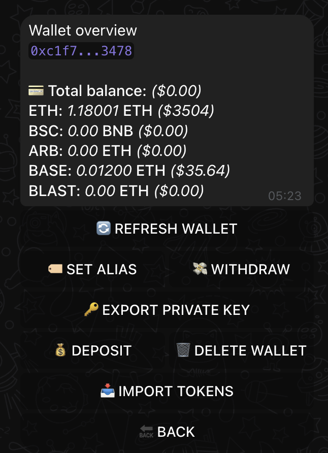

# XSHOT Bot Interface Guide

Welcome to your guide to mastering XSHOT Bot's interface. Learn how to navigate and use all features efficiently.

## Primary Interface

{ .screenshot-shadow }

The main interface displays your current blockchain, wallet address, and balance, along with quick access to XERS charts, documentation, and the X Project whitepaper.

## Trading Interface

=== "Quick Trading"
    ### Instant Trading
    Paste any contract address to start trading immediately. The bot will:

    1. Automatically detect the correct chain
    2. Switch networks if needed
    3. Prepare the trading interface
    4. Apply optimal settings

    !!! tip "Pro Tip"
        XSHOT Bookmark frequently traded tokens for faster access

=== "Buy Interface"
    ### Buying Tokens
    The buy interface offers flexible purchase options:

    - Enter amount in native token (e.g., SOL, ETH)
    - Quick-buy buttons with preset amounts
    - Custom slippage configuration
    - Auto-slippage technology

???+ note "Smart Slippage Algorithm"
    Our advanced auto-slippage technology finds the best slippage setting in milliseconds:

    1. **Quick Simulation**:
        - Starts with minimum slippage
        - No gas fees during testing
        - Takes milliseconds

    2. **Smart Adjustment**:
        - Automatically increases slippage if needed
        - Stops at first working value to ensures lowest possible slippage
        - Protect against MEV sandwich attack

    !!! example "Example"
        Buying a token:
        ❌ 1% → ❌ 2% → ❌ 3% → ✅ 3.5%
        Bot automatically sets 3.5% slippage

=== "Sell Interface"
    ### Selling Tokens
    The sell interface provides multiple options:

    - Sell by percentage (25%, 50%, 75%, 100%)
    - Enter custom percentage
    - Specify token amount
    - Auto-slippage support

## Advanced Trading

=== "Limit Orders"
    ### 🎯 Limit Trading
    Set up advanced trading positions:

    - **L-BUY**: Buy tokens at your target price
    - **L-SELL**: Sell tokens when they reach your goal
    - Track orders in the ORDERS menu

    [Learn more about limit orders](../features/trading/limit-orders.md)

=== "Portfolio"
    ### 💼 Holdings Management
    Track your investments:

    - View all holdings across chains
    - Monitor profit/loss
    - Quick access to trading functions

    [Learn more about portfolio management](../features/portfolio-management.md)

## Wallet Management

{ .screenshot-shadow }

### Access Methods

1. **Quick Command**: `/w[index]` (e.g., `/w1`)
2. **Direct Access**: Tap wallet address (auto-copies to clipboard)
3. **Menu Access**: Type `/w` and select wallet

### Wallet Features

=== "Basic Functions"
    - 🔄 **REFRESH WALLET**: Update balances
    - 💰 **DEPOSIT**: Generate QR code/address
    - 💸 **WITHDRAW**: Send tokens

=== "Management"
    - 📝 **SET ALIAS**: Custom wallet names
    - 📥 **IMPORT TOKENS**: Add custom tokens
    - 🗑️ **DELETE WALLET**: Remove wallet

=== "Security"
    - 🔑 **EXPORT PRIVATE KEY**: Backup access

    !!! danger "Critical"
        Never share your private key with anyone

## Available Commands

=== "Trading Commands"
    | Command | Function |
    |---------|-----------|
    | `/bridge` | [Cross-chain bridging](../features/bridging.md) |
    | `/launchpad` | Token launchpad |
    | `/premium` | [Premium features](../premium-features/premium-chat.md) |

=== "Management Commands"
    | Command | Function |
    |---------|-----------|
    | `/profile` | Profile details |
    | `/w` | View wallets |
    | `/settings` | Global settings |

=== "General Commands"
    | Command | Function |
    |---------|-----------|
    | `/start` | Restart bot |
    | `/help` | Show commands |

## Best Practices

!!! success "Trading Tips"
    - Use auto-slippage for optimal trade execution
    - Refresh balances before trading
    - Set aliases for better wallet organization

!!! warning "Security First"
    - Export and securely store private keys
    - Verify contract addresses before trading
    - Double-check transaction details

!!! info "Stay Updated"
    - Join our [Support Channel](https://t.me/Xshot_trading)
    - Follow our [Main Community](https://t.me/xerc20)
    - Check [Common Issues](../troubleshooting/common-issues.md)

## Quick Examples

=== "Buy Token"
    ```mermaid
    graph LR
        A[Paste CA] --> B[Auto Chain Detection]
        B --> C[Enter Amount]
        C --> D[Auto Slippage]
        D --> E[Confirm Trade]
    ```

=== "Manage Wallets"
    ```mermaid
    graph LR
        A[Access Wallet] --> B[Set Alias]
        B --> C[Import Tokens]
        C --> D[Monitor Balance]
    ```

## Support Resources

Need help? Here's how to get support:

[Support Channel :fontawesome-solid-headset:](https://t.me/Xshot_trading){ .md-button }
[Main Community :fontawesome-solid-users:](https://t.me/xerc20){ .md-button }
[Common Issues :fontawesome-solid-circle-question:](../troubleshooting/common-issues.md){ .md-button }
