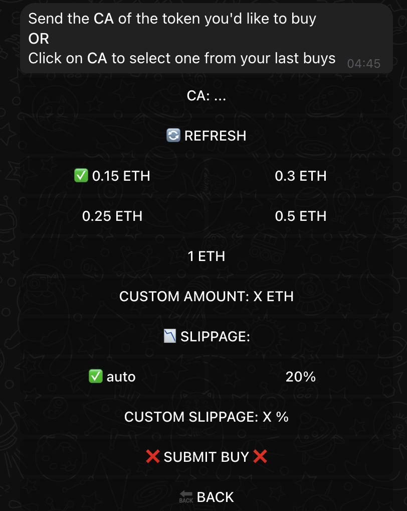
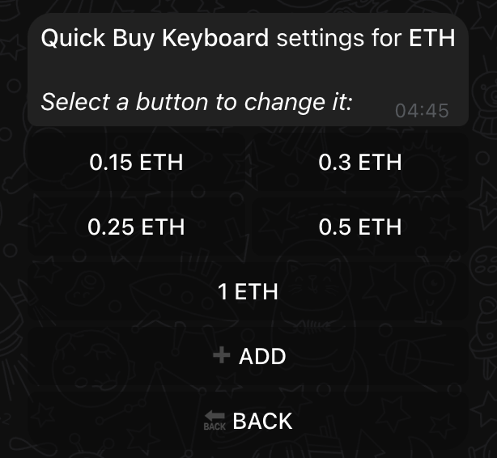
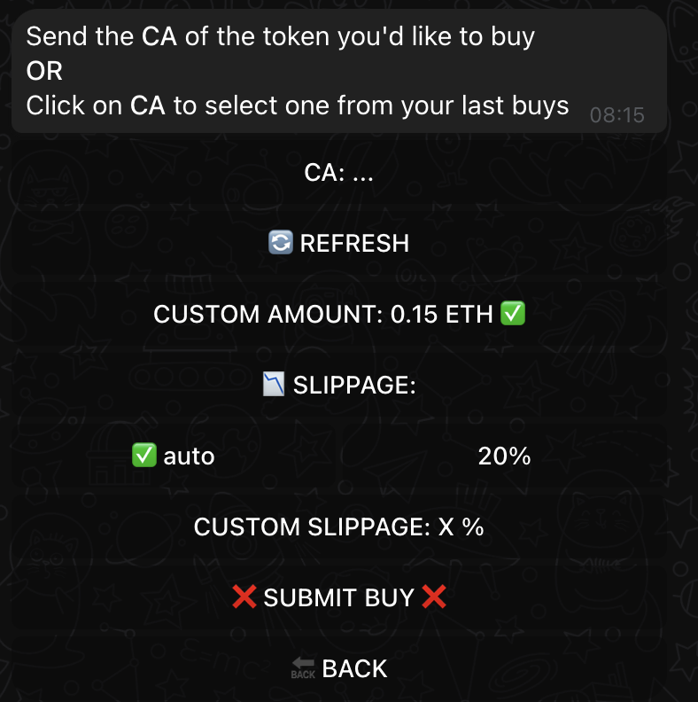

# ⚡ Quick Buy Keyboard

## Initial Configuration

!!! info "Setup-Based Configuration"
    During your [initial setup](../getting-started/setup-guide.md#transaction-size-configuration), your trading preferences determine your Quick Buy Keyboard:

=== "Micro Trader"
       Based on your typical transaction size below $100:

       - ETH/ARB/BASE/BLAST: 0.15, 0.25, 0.3, 0.5 ETH
       - BSC: 0.5, 1, 1.5, 2 BNB
       - SOL: 1, 2, 3, 5 SOL
       - TRON: 1000, 2000, 3000, 5000 TRX

=== "Small-Medium Trader"
       Based on your typical transaction size $100 - $1000:

       - ETH/ARB/BASE/BLAST: 0.5, 0.75, 1.0, 1.25 ETH
       - BSC: 2, 3, 4, 5 BNB
       - SOL: 5, 10, 15, 20 SOL
       - TRON: 5000, 7500, 10000, 12500 TRX

=== "Large Trader"
       Based on your typical transaction size $1000 - $5000:

       - ETH/ARB/BASE/BLAST: 2.5, 5.0, 7.5, 10.0 ETH
       - BSC: 10, 20, 30, 40 BNB
       - SOL: 25, 50, 75, 100 SOL
       - TRON: 25000, 50000, 75000, 100000 TRX

=== "Whale Trader"
       Based on your typical transaction size above $5000:

       - ETH/ARB/BASE/BLAST: 10, 20, 30, 40 ETH
       - BSC: 40, 80, 120, 160 BNB
       - SOL: 100, 200, 300, 400 SOL
       - TRON: 100000, 200000, 300000, 400000 TRX

## Chain-Specific Settings

!!! warning "Individual Chain Configuration"
    Each blockchain maintains its own Quick Buy Keyboard settings.

=== "Managing Multiple Chains"
    To maintain consistent amounts across chains:

    1. Configure each chain individually
    2. Use same values for uniformity
    3. Adjust per chain if needed

=== "Chain-Specific Values"
    Customize based on:

    - Chain-specific token prices
    - Network fees
    - Trading patterns

## Using Quick Buy

{ .screenshot-shadow }

### Interface Elements

1. Preset amount buttons
2. Custom amount option
3. Slippage settings
4. Transaction confirmation

???+ tip "Quick Trade Tips"

    - Use preset buttons for faster execution
    - Custom amount for precise trades
    - Auto-slippage for optimal execution

## Customization

### Access Settings
{ .screenshot-shadow }

1. Navigate to [chain settings](../features/settings.md)
2. Select "QUICK BUY KEYBOARD"
3. View current configuration

### Modify Buttons
{ .screenshot-shadow }

=== "Adding Buttons"

    1. Click "ADD"
    2. Enter amount
    3. Confirm addition

=== "Editing Buttons"

    1. Select button
    2. Modify value
    3. Save changes

=== "Removing Buttons"

    1. Select button
    2. Choose remove
    3. Confirm deletion

### Minimal Interface

Remove all quick buy buttons for a cleaner interface:

{ .screenshot-shadow }

## Best Practices

!!! example "Optimization Strategies"

    === "Efficiency"

        - Use your most used as button
        - Tailored for each chain differently

    === "Management"

        - Regularly review and adjust the button as needed
        - Adjust if market conditions change

## Integration with Trading

The Quick Buy Keyboard integrates with:

- [Basic buying](../features/trading/buying.md)
- [Limit orders](../features/trading/limit-orders.md)
- [Portfolio management](../features/portfolio-management.md)

## Quick Setup Steps

1. Access chain settings
2. Select Quick Buy Keyboard
3. Configure buttons
4. Test configuration
5. Repeat for other chains if needed

## Related Guides

Need more information?

[Trading Guide](../features/trading/buying.md){ .md-button .md-button--primary }
[Chain Settings](../features/settings.md){ .md-button .md-button--primary }
[Setup Guide](../getting-started/setup-guide.md){ .md-button }

!!! tip "💡 Pro Tips"

    - Configure based on your trading strategy
    - Review settings after market changes
    - Use consistent values across chains if needed
    - Adjust per chain for optimal trading
