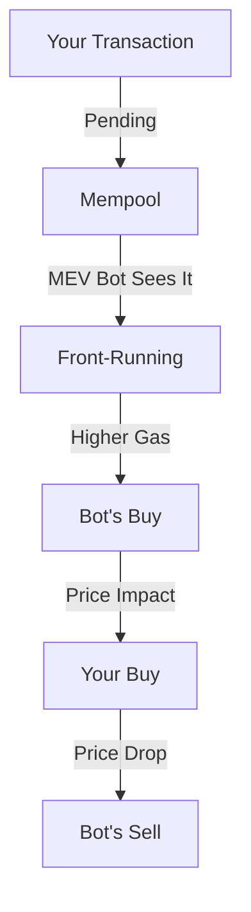
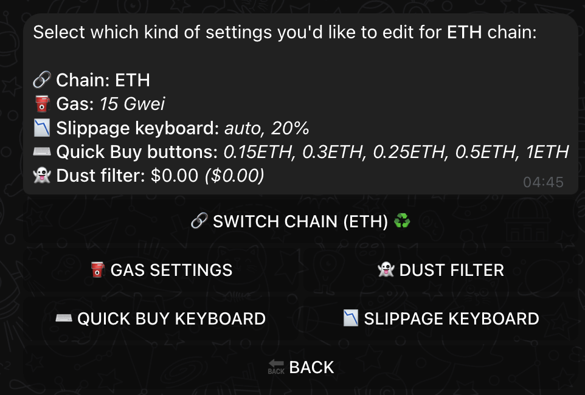
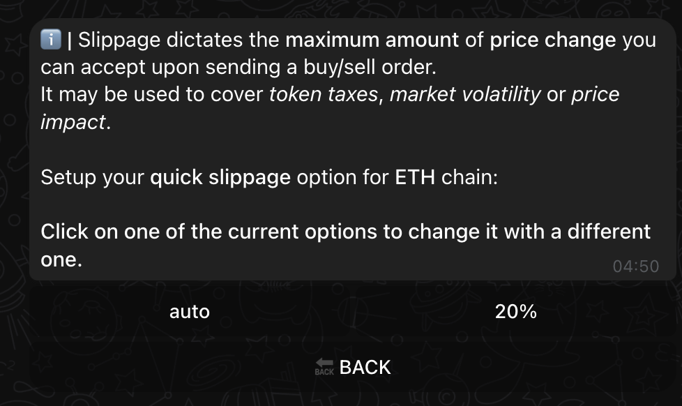
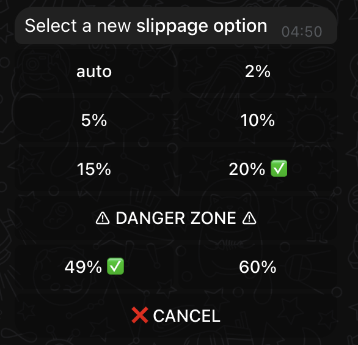
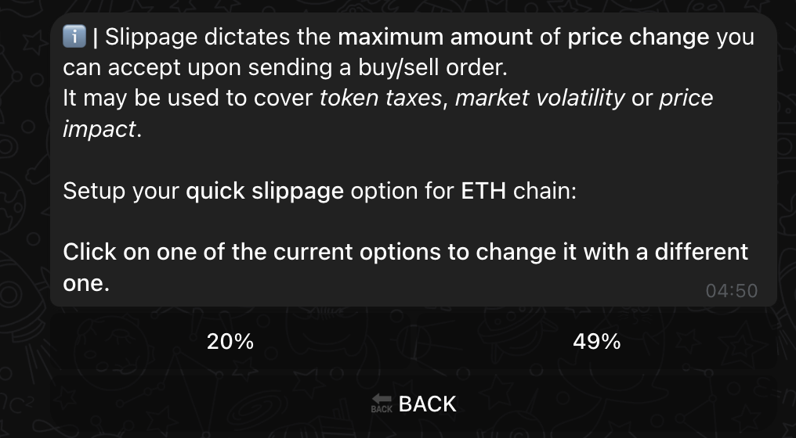
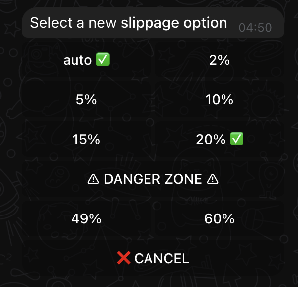

# Slippage

Ever wondered why some of your trades get "sandwiched" or fail? Let's master slippage with XSHOT to protect your trades and maximize success.

## Understanding the Battlefield

### What's Really Happening With Your Trades

When you submit a transaction, you enter a high-speed arena where MEV bots are waiting to profit from your trades:

!!! danger "Real World Example"
    Imagine buying a token at $1.00 with 20% slippage:

    1. Bot sees your pending transaction
    2. Buys before you, pushing price to $1.15
    3. Your transaction executes at higher price
    4. Bot sells immediately
    5. You're left holding at a loss

## Your XSHOT Slippage Journey

### Getting Started

{ .screenshot-shadow }

Go into the chain you want to adjust slippage from
enter the chain settings menu and click on SLIPPAGE KEYBOARD

---

{ .screenshot-shadow }

When you first set up XSHOT, your slippage settings are configured based on:

- Your trading style
- Risk tolerance
- Chain preferences

!!! tip "Setup Tip"
    Your initial settings from the [setup questionnaire](../getting-started/setup-guide.md) create a baseline, but you can optimize per chain.

### Chain-Specific Configuration

{ .screenshot-shadow }

Each blockchain has its own slippage keyboard, you can configure a button with these values:

=== "Standard Options"

    - 2-5%: Regular tokens
    - 10-15%: Tax tokens
    - 20%: High tax tokens

=== "⚠️ Danger Zone"

    - 49-60%: High risk
    - MEV vulnerable
    - Emergency only

### Configuring Your Protection

{ .screenshot-shadow }

1. Access chain settings
2. Select "SLIPPAGE KEYBOARD"
3. Check that you either have auto (beginner)
4. Or have a strict slippage set in the safe area (expert)

{ .screenshot-shadow }

Customize the slippage based on:

- Token type
- Market conditions
- Trade size (your price impact)

!!! success "Auto Slippage:"
    ✓ MEV Protection

    ✓ Optimal execution

    ✓ Dynamic adjustment

## Daily Trading Strategies

### Token Types and Slippage

=== "Standard Tokens"

    - Use auto slippage
    - 2-5% range
    - Monitor execution

=== "Tax Tokens"

    - Check token contract
    - Add 2-3% to tax amount
    - Test small trades first

=== "Volatile Tokens"

    - Higher slippage needed
    - Use limit orders when possible
    - Monitor price impact

[Learn about Limit Orders →](../features/trading/limit-orders.md)

### Smart Protection Features

{ .screenshot-shadow }

XSHOT helps protect your trades:

- Auto slippage calculation
- Built-in MEV protection
- Chain-optimized settings

## Advanced Strategies

### Chain-Specific Approaches

Different chains need different strategies:

- [Ethereum](../supported-chains/ethereum.md): Higher gas, lower slippage
- [BSC](../supported-chains/binance-smart-chain.md): Watch for tax tokens
- [Solana](../supported-chains/solana.md): Faster execution, different MEV landscape
- [Base](../supported-chains/base.md): Growing ecosystem considerations

### Market Condition Adaptation

!!! tip "Market-Based Adjustments"

    - High volatility: Increase slippage slightly
    - Low liquidity: Use limit orders
    - New tokens: Extra caution with slippage
    - [Use XCALLER AI](../premium-features/xcaller-ai.md) for smart execution

### Large Trade Protection

For significant positions:

1. Split into smaller trades
2. Use limit orders
3. Consider time of day
4. Monitor pool liquidity

## Best Practices

### Daily Checklist

- ✓ Check token taxes
- ✓ Verify liquidity
- ✓ Review market conditions
- ✓ Set appropriate slippage

### Red Flags

- Unusually high required slippage
- Sudden liquidity changes
- Forced high slippage settings

## Need Help?

Trading safely is crucial. Get support:

[📱 Support Channel](https://t.me/Xshot_trading){ .md-button .md-button--primary }
[👥 Trading Community](https://t.me/xerc20){ .md-button }
[📚 Common Issues](../troubleshooting/common-issues.md){ .md-button }

!!! quote "💫 Final Thought"
    Smart slippage management isn't just about successful trades - it's about protecting your capital in the DeFi jungle.

